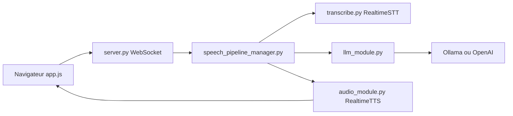

# KoljaB/RealtimeVoiceChat

> Application web pour parler à voix haute avec un LLM local ou OpenAI, latence réduite, pour bricoleurs IA.

## Le problème
Un assistant vocal complet (micro, transcription, LLM, synthèse, coupure de parole) demande d'assembler soi-même quatre briques temps réel.

## Ce que ça fait vraiment
Le navigateur capte le micro et envoie des morceaux audio par WebSocket à un serveur FastAPI (`server.py`). `SpeechPipelineManager` enchaîne transcription (RealtimeSTT), détection de fin de tour (`turndetect.py`), LLM (Ollama par défaut, OpenAI possible via `llm_module.py`) puis synthèse vocale (Kokoro, Coqui ou Orpheus via `audio_module.py`). L'audio revient en flux et l'utilisateur peut interrompre. Le réglage se fait en éditant les fichiers Python.

## Comment c'est branché


## Essayer
```bash
git clone https://github.com/KoljaB/RealtimeVoiceChat.git
cd RealtimeVoiceChat
docker compose build
docker compose up -d
docker compose exec ollama ollama pull hf.co/bartowski/huihui-ai_Mistral-Small-24B-Instruct-2501-abliterated-GGUF:Q4_K_M
# puis http://localhost:8000
```

## Coût et pièges
GPU NVIDIA (CUDA 12.1) fortement conseillé, NVIDIA Container Toolkit sous Linux ; la construction des images est longue. Toute modification de config doit précéder `docker compose build`. Clé OpenAI seulement si ce backend est choisi.

## Ce que ce n'est pas
Pas un projet suivi : l'auteur écrit ne plus assurer ni nouveautés ni support, et ne relit que quelques PR. Aucune licence n'est déclarée : réutiliser le code est juridiquement incertain. Le modèle Ollama par défaut est un 24B, lourd pour un poste modeste.

## Alternatives
Aucune alternative n'est citée dans le README ; les briques RealtimeSTT et RealtimeTTS (même auteur) se réutilisent séparément.

## Pour toi
Ignorer comme base de projet (sans licence, plus maintenu, 41 issues ouvertes), mais le découpage STT/tour de parole/LLM/TTS reste une bonne lecture pour comprendre un pipeline vocal.
