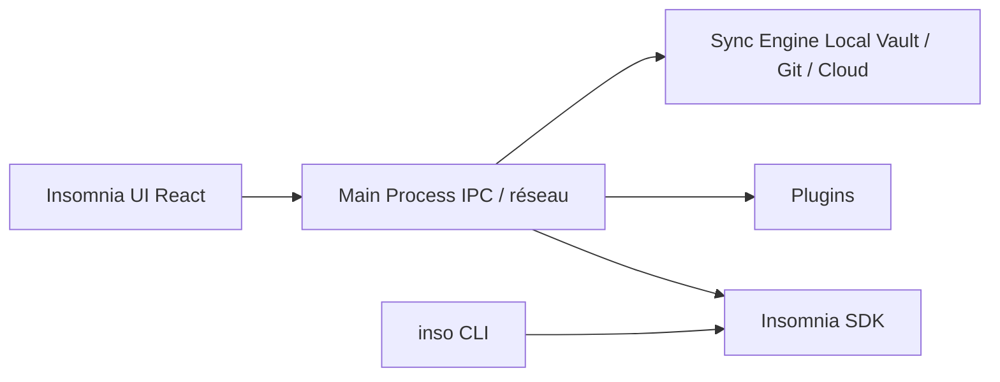

# Kong/insomnia

> Client d'API open source pour REST, GraphQL, gRPC, WebSocket et SSE, avec conception, tests et mocks.

## Le problème
Tester, documenter et partager des appels d'API demande souvent plusieurs outils qui ne se synchronisent pas.

## Ce que ça fait vraiment
Application de bureau (Electron, React) pour déboguer des API, éditer des spécifications OpenAPI, écrire des suites de tests, lancer des collections et simuler des API. Trois stockages : Local Vault (100 % local), Git Sync, Cloud Sync (chiffrement de bout en bout possible). Une CLI `inso` sert pour la CI, et des plugins s'installent.

## Comment c'est branché


## Essayer
```bash
npm i
npm run lint
npm run type-check
npm test
npm run dev
./packages/insomnia-inso/bin/inso -v
```

## Coût et pièges
Gratuit avec le Scratch Pad local ; la plupart des fonctions demandent un compte, et les fonctions premium sont payantes. Les données peuvent rester en local ou dans Git. Compiler demande Node.js (voir `.nvmrc`).

## Ce que ce n'est pas
Pas un outil de test de charge ni de supervision d'API. Le compte est demandé pour financer le produit, selon le README.

## Alternatives
- Aucune alternative nommée dans le README.

## Pour toi
Surveiller : pratique pour essayer des points d'accès de modèles ou d'API de données, mais le compte requis pour l'essentiel pèse face à un simple `curl`.

