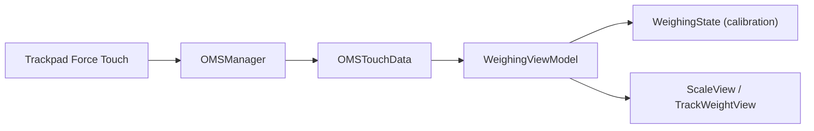

# KrishKrosh/TrackWeight

> Application macOS qui transforme le trackpad Force Touch d'un MacBook en balance numérique, par curiosité.

## Le problème
Aucun besoin réel : montrer qu'on peut lire la pression du trackpad et l'exprimer en grammes.

## Ce que ça fait vraiment
Utilise un fork de la bibliothèque Open Multi-Touch Support pour lire les événements de pression du trackpad (accès privé macOS). Il faut garder un doigt en contact et poser l'objet dessus en pressant le moins possible. L'auteur affirme que les données sont déjà en grammes et les a comparées à une balance de référence. Interface SwiftUI et Combine, architecture MVVM.

## Comment c'est branché


## Essayer
```bash
brew install --cask krishkrosh/apps/trackweight --force
```

## Coût et pièges
Gratuit. Exige macOS 13+ et un MacBook Force Touch, avec le bac à sable désactivé. Les objets en métal peuvent fausser la mesure. Dernier push en juillet 2025.

## Ce que ce n'est pas
Pas un instrument de mesure : l'auteur le déclare expérimental et déconseille tout usage critique ou commercial.

## Alternatives
Aucune alternative nommée dans le README.

## Pour toi
À ignorer : gadget macOS sans lien avec la data ou l'IA, et non mis à jour depuis plus d'un an.

