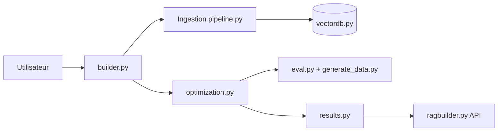

# KruxAI/ragbuilder

> Bibliothèque Python qui règle automatiquement ingestion, récupération et génération d'un RAG sur tes données.

## Le problème
Choisir découpage, embeddings, retrievers et reranker d'un RAG se fait à l'intuition, sans mesure sur ses propres documents.

## Ce que ça fait vraiment
`RAGBuilder` lance une optimisation bayésienne (Optuna) sur des paramètres d'ingestion (chargeurs, découpage, taille de chunk, embeddings), de récupération (vectoriel, BM25, multi-requête, graphe via Neo4j, rerankers) et de génération, évalués sur un jeu de test fourni ou synthétique avec Ragas. Le pipeline retenu peut être interrogé, sauvegardé, rechargé ou servi par `POST /query`.

## Comment c'est branché


## Essayer
```bash
uv venv ragbuilder
source ragbuilder/bin/activate
uv pip install ragbuilder
```
```python
from ragbuilder import RAGBuilder
builder = RAGBuilder.from_source_with_defaults(input_source='https://lilianweng.github.io/posts/2023-06-23-agent/')
results = builder.optimize()
```

## Coût et pièges
`OPENAI_API_KEY` requise (Azure, Mistral, Cohere en option) : chaque essai de l'optimisation consomme des appels LLM. Neo4j pour le retriever graphe. Analytique anonyme par défaut, désactivable par `ENABLE_ANALYTICS=False`.

## Ce que ce n'est pas
Pas un RAG prêt à l'emploi : c'est un outil de réglage. Dernier push en mai 2025 ; un exemple du README utilise une variable non définie (`adv_results`). `serve` écoute sur 0.0.0.0.

## Alternatives
Aucune alternative nommée dans le README (Ragas est utilisé en interne).

## Pour toi
À surveiller : l'idée d'un réglage automatisé du RAG est pertinente, mais le dépôt n'a pas bougé depuis seize mois.
