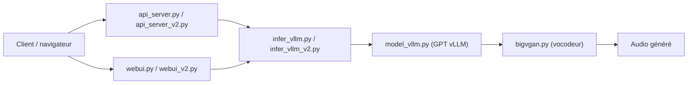

# Ksuriuri/index-tts-vllm

> Réimplémentation de l'inférence GPT d'IndexTTS avec vLLM pour synthétiser la voix plus vite sur GPU.

## Le problème
IndexTTS génère la voix lentement : ≈0,3 de RTF et ≈90 tokens/s en décodage sur une RTX 4090, et la concurrence est limitée.

## Ce que ça fait vraiment
Remplace l'étage GPT d'IndexTTS (v1, v1.5, v2) par une exécution vLLM. Le README annonce ≈0,1 de RTF et ≈280 tokens/s sur une 4090, ~16 requêtes concurrentes avec ~5 Go de VRAM. Fournit une WebUI, une API FastAPI (port 6006) et des routes compatibles OpenAI (`/audio/speech`, `/audio/voices`). En v2, seul le GPT est parallélisé ; s2mel reste sériel (TODO du README).

## Comment c'est branché


## Essayer
```bash
git clone https://github.com/Ksuriuri/index-tts-vllm.git
cd index-tts-vllm
conda create -n index-tts-vllm python=3.12
conda activate index-tts-vllm
pip install uv
uv pip install -r requirements.txt -c overrides.txt
modelscope download --model kusuriuri/IndexTTS-2-vLLM --local_dir ./checkpoints/IndexTTS-2-vLLM
python webui_v2.py
```

## Coût et pièges
GPU NVIDIA nécessaire ; poids à télécharger (ModelScope ou Hugging Face) ; premier lancement long (compilation CUDA de bigvgan). Le README avoue que les API v1/v1.5 et OpenAI-compatibles peuvent avoir des bugs.

## Ce que ce n'est pas
Pas un modèle TTS nouveau : c'est un accélérateur d'inférence pour IndexTTS. Pas de gain d'accélération sur toute la chaîne v2 (s2mel non optimisé). README principalement en chinois.

## Alternatives
Le README ne nomme que le projet amont index-tts (plus lent, mais référence officielle).

## Pour toi
À surveiller : utile si tu sers déjà IndexTTS sur GPU et veux du débit, mais mainteneur unique et API partiellement bugguée.
