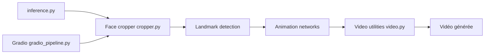

# KwaiVGI/LivePortrait

> Anime un portrait (image ou vidéo) à partir d'une vidéo pilote, implémentation PyTorch officielle.

## Le problème
Animer un visage fixe avec les expressions d'une vidéo, avec un contrôle fin, demande des modèles lourds et lents.

## Ce que ça fait vraiment
Prend une image/vidéo source et une vidéo pilote (ou un fichier de mouvement `.pkl`), recadre les visages, calcule le mouvement et génère une vidéo. Mode humains et mode animaux (X-Pose, Linux/Windows avec GPU NVIDIA). Interface Gradio, évaluation de vitesse, recadrage automatique de la vidéo pilote.

## Comment c'est branché


## Essayer
```bash
conda create -n LivePortrait python=3.10
pip install -r requirements.txt
huggingface-cli download KlingTeam/LivePortrait --local-dir pretrained_weights --exclude "*.git*" "README.md" "docs"
python inference.py
python app.py
```

## Coût et pièges
GPU NVIDIA conseillé (macOS : jusqu'à 20× plus lent) ; conda, FFmpeg, poids à télécharger. Licence non identifiée par GitHub. Risque de détournement en deepfake, reconnu par le README.

## Ce que ce n'est pas
Pas un service prêt à l'emploi ; pas conçu pour la synchronisation labiale par audio.

## Alternatives
Aucune alternative nommée dans le README.

## Pour toi
Bon terrain d'expérience pour la génération vidéo ; clarifie la licence avant tout usage commercial.

