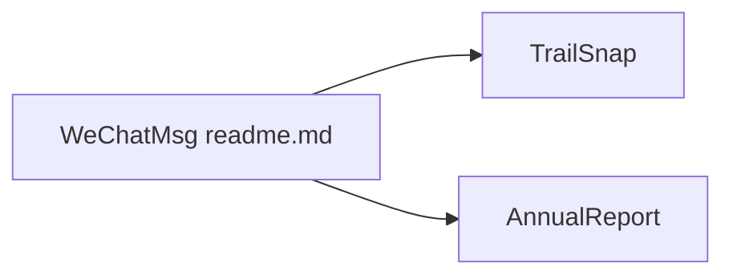

# LC044/WeChatMsg

> Dépôt vide de code, ancien outil WeChat, aujourd'hui simple page de renvoi vers d'autres projets.

## Le problème
Non documenté : le README ne décrit plus aucun outil fonctionnel.

## Ce que ça fait vraiment
Rien d'exécutable : l'arbre ne contient que le README et des images. L'auteur annonce que le projet n'est plus mis à jour et renvoie vers TrailSnap (album photo IA), EasyBox et AnnualReport.

## Comment c'est branché

## Essayer
Aucune commande documentée.

## Coût et pièges
Aucune licence déclarée : rien de réutilisable légalement.

## Ce que ce n'est pas
Pas un exportateur de messages WeChat, malgré le nom et les étoiles.

## Alternatives
Aucune nommée.

## Pour toi
À ignorer.
