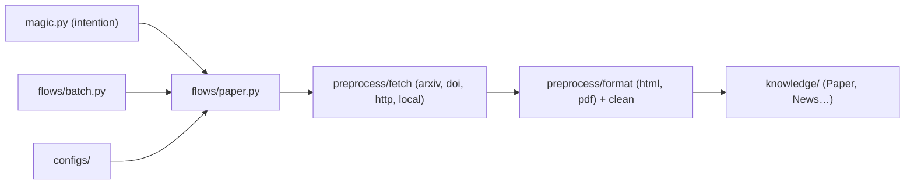

# LLMQuant/quant-mind

> Bibliothèque Python qui transforme papiers et actualités financières en connaissances typées et citées.

## Le problème
Les informations financières brutes (papiers, dépêches) sont peu exploitables par un RAG : sans source, sans date, sans structure.

## Ce que ça fait vraiment
`PaperFlow` transforme un papier arXiv en arbre de structure paginé ou en chunks plus un résumé cité. `collect_news` collecte des fenêtres de dépêches, `batch_run` fait la concurrence, `magic` transforme une consigne libre en configuration. Chaque artefact porte texte, date `as_of` et référence source. Le dépôt est aussi conçu pour être « ouvert » par un agent (contrats AGENTS.md/CLAUDE.md, `scripts/verify.sh`). Le module `mind/` de recherche agentique est annoncé, absent de l'arbre ; l'évaluation est « en conception ».

## Comment c'est branché


## Essayer
```bash
uv venv && source .venv/bin/activate
uv pip install -e .
git clone https://github.com/LLMQuant/quant-mind.git
cd quant-mind && claude
```

## Coût et pièges
Les exemples appellent un modèle via API (clé à ta charge). Certains noms de modèles du README sont propres à l'auteur. Aucun résultat d'évaluation publié.

## Ce que ce n'est pas
Pas encore un moteur de récupération : la partie recherche est annoncée. Le produit hébergé LLMQuant Data est distinct.

## Alternatives
Non documenté dans le README.

## Pour toi
Surveiller : l'idée de connaissances datées et citées convient à la finance quantitative, mais l'API bouge encore et la recherche n'existe pas.
