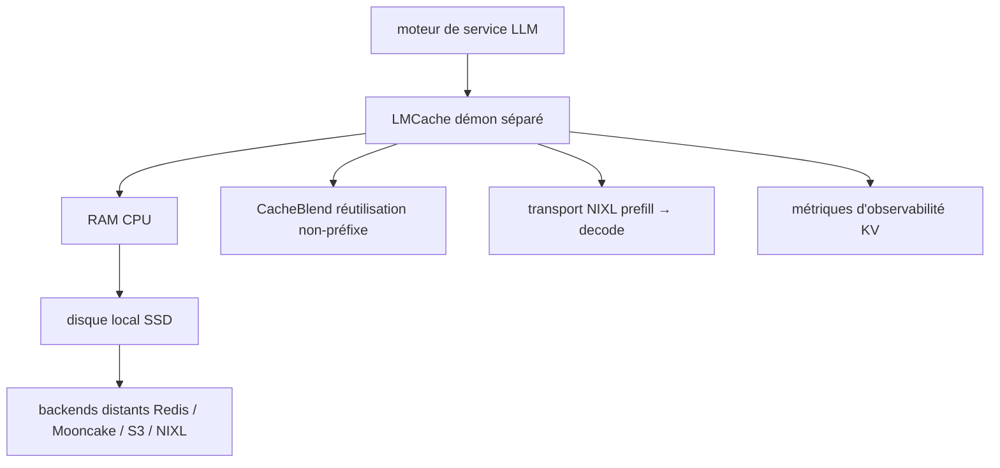

# LMCache/LMCache

> Couche de gestion du cache KV pour serveurs de LLM, pour réduire le TTFT sur contextes longs.

## Le problème
Le cache KV vit et meurt avec le processus du moteur d'inférence : un crash, et tout le préfill est à recalculer.
Sur du RAG, du multi-tour ou de l'agentique, on recalcule sans cesse les mêmes préfixes.

## Ce que ça fait vraiment
Tourne comme démon distinct du moteur d'inférence, donc le cache KV survit au crash du moteur.
Déverse le cache KV hors de la mémoire GPU vers une hiérarchie : RAM CPU, disque local, puis backends distants (Redis/Valkey, Mooncake, InfiniStore, S3, NIXL, GDS).
Réutilise des blocs KV ailleurs qu'en préfixe grâce à CacheBlend, en recalculant sélectivement les tokens pour récupérer la qualité.
Transfère le KV des workers de prefill vers ceux de decode (désagrégation PD) sur NVLink, RDMA ou TCP, et expose des métriques de cache (hits préfixe par requête et par token, cycle de vie, usage par utilisateur).

## Comment c'est branché


## Essayer
```bash
pip install lmcache
```

## Coût et pièges
Gratuit, mais l'intérêt suppose une infrastructure d'inférence GPU déjà en place, et un backend de stockage à provisionner.
Le README ne donne qu'une commande d'installation : tout le paramétrage réel vit dans les pages Installation, Quickstart et Production Deployment.

## Ce que ce n'est pas
Pas un moteur d'inférence : il s'insère sous un moteur existant, il ne sert pas de modèle.
Pas une base de données : le cache KV réutilisé n'est pas une mémoire sémantique interrogeable.
Pas un projet d'un seul fournisseur — la neutralité est revendiquée — mais son développement est soutenu en partie par Tensormesh.

## Alternatives
Aucune alternative nommée ; les dépôts cités (Mooncake, InfiniStore, NIXL) sont des backends, pas des remplaçants.

## Pour toi
À suivre de près si tu sers des LLM à contexte long : c'est le levier de latence le plus direct après le batching.
