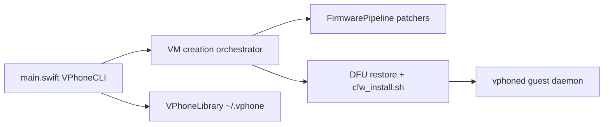

# Lakr233/vphone-cli

> CLI macOS qui démarre un iPhone virtuel via Virtualization.framework, pour chercheurs en sécurité iOS.

## Le problème
Étudier iOS sans appareil physique demande une machine virtuelle et un pipeline de firmware complexe.

## Ce que ça fait vraiment
Prépare des firmwares iPhone et cloudOS, patche la chaîne de démarrage, restaure en DFU, installe un CFW et lance la VM. Cinq variantes de patch (`less` à `exp`, de 4 à 141 patches ; `jb` inclut un jailbreak complet). Socket de contrôle pour captures, toucher et presse-papier, pensé pour des tests pilotés par IA.

## Comment c'est branché


## Essayer
```bash
brew install zqxwce/tap/vphone-cli
vphone-cli vm create myphone -V jb
vphone-cli vm launch myphone
```

## Coût et pièges
Apple Silicon, macOS 15+, Xcode. Exige d'assouplir SIP/AMFI sur l'hôte (`csrutil disable`, boot-arg AMFI), ce qui affaiblit la sécurité du Mac. Ne fonctionne pas dans une VM imbriquée.

## Ce que ce n'est pas
Pas un émulateur grand public : c'est un outil de recherche qui contourne des protections Apple.

## Alternatives
Aucune alternative citée dans le README (vphone-mcp est cité pour l'automatisation).

## Pour toi
À ignorer : recherche sécurité iOS de niche, exigeant de relâcher SIP/AMFI, sans lien avec data/IA/MLOps.

