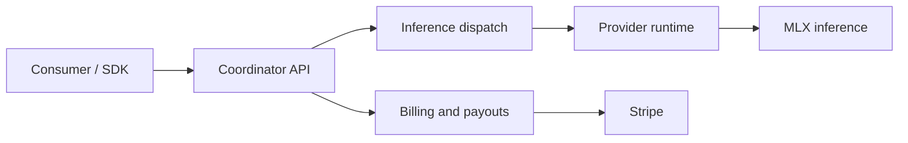

# Layr-Labs/d-inference

> Réseau d'inférence privé décentralisé sur Macs Apple Silicon, compatible OpenAI, pour consommateurs et propriétaires de Mac.

## Le problème
L'inférence LLM passe par des intermédiaires chers, tandis que des millions de Macs restent inactifs. Le risque : l'hôte du Mac ne doit pas lire les prompts.

## Ce que ça fait vraiment
Un coordinateur Go (Confidential VM) authentifie, route, facture et relaie des requêtes chiffrées NaCl Box vers des fournisseurs. Ceux-ci sont des Macs qui font tourner MLX dans le processus et se connectent en sortie par WebSocket. L'API accepte OpenAI et Anthropic. L'attestation matérielle passe par Secure Enclave, MDM et APNs. Statut annoncé : Public Alpha.

## Comment c'est branché


## Essayer
```bash
curl https://api.darkbloom.dev/v1/chat/completions \
  -H "Authorization: Bearer sk-db-..." \
  -H "Content-Type: application/json" \
  -d '{"model":"gemma-4-26b","messages":[{"role":"user","content":"Hello!"}],"stream":true}'
curl -fsSL https://api.darkbloom.dev/install.sh | bash
darkbloom start
```

## Coût et pièges
Facturation au token (repli : 0,05 $/M en entrée, 0,20 $/M en sortie), dépôt via Stripe. Le texte est visible en clair dans la mémoire chiffrée du coordinateur, pas de bout en bout absolu. Le README annonce des changements cassants et des coupures.

## Ce que ce n'est pas
Ce n'est pas du « zéro confiance » : le README précise que le coordinateur voit transitoirement le texte. Pas d'endpoint embeddings (404). Dépend du service hébergé api.darkbloom.dev.

## Alternatives
Le README compare uniquement aux API hébergées classiques ; aucun dépôt alternatif nommé.

## Pour toi
Surveiller : idée intéressante pour de l'inférence bon marché, mais alpha, dépendant d'un SaaS et de licence à vérifier ; à ne pas mettre sur des données sensibles.
