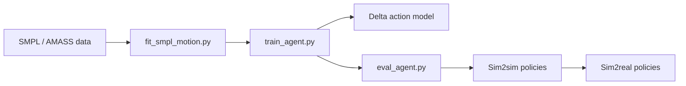

# LeCAR-Lab/ASAP

> Code de recherche (RSS 2025) pour entraîner un humanoïde à des mouvements agiles et réduire l'écart simulation-réel.

## Le problème
Une politique apprise en simulation se comporte mal sur le robot réel à cause des différences de physique.

## Ce que ça fait vraiment
Bâti sur HumanoidVerse (IsaacGym, IsaacSim, Genesis). Fournit l'entraînement de suivi de mouvement par phases, les jeux de mouvements du papier, le retargeting depuis SMPL/AMASS vers le robot Unitree G1, l'entraînement d'un modèle d'action delta pour corriger la physique, puis le sim2sim (MuJoCo) et le sim2real via UnitreeSDK.

## Comment c'est branché


## Essayer
```bash
conda create -n hvgym python=3.8
pip install -e isaacgym/python
pip install -e .
python humanoidverse/train_agent.py +simulator=isaacgym +exp=locomotion +robot=g1/g1_29dof_anneal_23dof num_envs=1 headless=False
```

## Coût et pièges
GPU NVIDIA indispensable, IsaacGym à télécharger, ROS2 et SDK Unitree pour le déploiement, et un robot G1 pour le sim2real. Le dernier push date de janvier 2026.

## Ce que ce n'est pas
Pas un outil prêt à l'emploi : un dépôt de recherche à reproduire. Les auteurs déconseillent de lancer les modèles sur un robot réel sans expertise sim-to-real.

## Alternatives
Aucune alternative nommée (le README cite HumanoidVerse et Human2Humanoid, dont il dérive).

## Pour toi
À surveiller : intéressant pour comprendre l'apprentissage par renforcement sim2real et le modèle d'action delta, mais inutile sans GPU ni robot.
