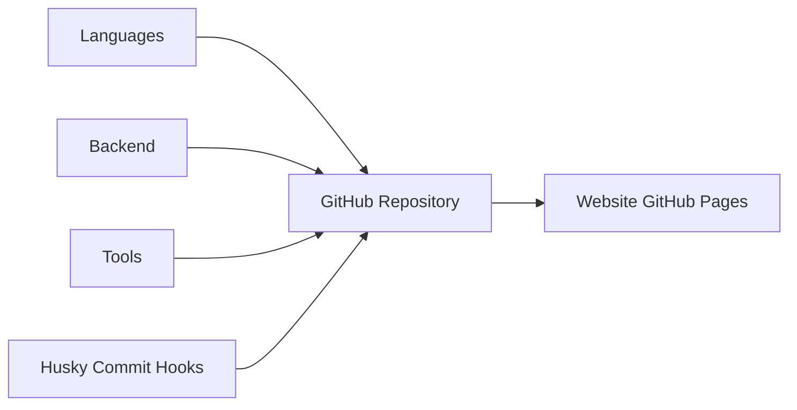

# LeCoupa/awesome-cheatsheets

> Recueil d'aide-mémoire, un fichier par langage ou outil, pour développeurs généralistes.

## Le problème
Retrouver vite la syntaxe d'un outil oublié oblige à fouiller des documentations longues.

## Ce que ça fait vraiment
Un fichier par technologie : langages (Bash, Python, Go, JS…), backends (Django, Laravel, Express…), frontends (React, Vue…), bases (MySQL, MongoDB, Redis), outils (Git, Docker, Kubernetes, AWS CLI…). Contenu tiré de la documentation officielle et de livres, selon l'auteur. Un site web en donne une version navigable.

## Comment c'est branché

## Essayer
Aucune commande documentée : on lit les fichiers.

## Coût et pièges
Rien. Certaines fiches couvrent des outils datés (AngularJS, Nanobox).

## Ce que ce n'est pas
Pas une documentation à jour ni exhaustive ; rien sur la data ou le ML au-delà de Python.

## Alternatives
Aucune nommée dans le README.

## Pour toi
Des aide-mémoire généralistes, sans rien de spécifique à la data ou à l'IA : un moteur de recherche fait aussi bien. À ignorer.
