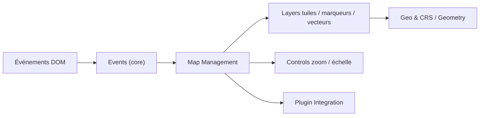

# Leaflet/Leaflet

> Bibliothèque JavaScript légère pour afficher des cartes interactives dans un navigateur, pour développeurs web.

## Le problème
Publier une carte interactive (fond de tuiles, marqueurs, formes, popups) sans dépendre d'une plateforme cartographique lourde.

## Ce que ça fait vraiment
Leaflet gère le rendu de cartes côté client : tuiles, marqueurs, couches vectorielles, popups, contrôles (zoom, échelle, attribution) et interactions tactiles. Environ 40 kB de JS et 3,2 kB de CSS compressés. L'API est extensible par de nombreux plugins listés sur le site. Le README s'ouvre sur un long message de soutien à l'Ukraine, pays du créateur.

## Comment c'est branché


## Essayer
```bash
# Aucune commande documentée dans le README ; téléchargements et tutoriels sur leafletjs.com
```

## Coût et pièges
Gratuit, sans clé. Les fonds de carte viennent de fournisseurs de tuiles tiers, avec leurs conditions ; ce coût n'est pas décrit dans le README.

## Ce que ce n'est pas
Ni un SIG, ni un moteur d'analyse géospatiale, ni une source de données de carte : il affiche des cartes que tu alimentes.

## Alternatives
- Aucune alternative nommée dans le README.

## Pour toi
Adopter pour tout tableau de bord ou démo data qui affiche des points sur une carte : petit, ancien, très répandu, et sous BSD-2-Clause.

