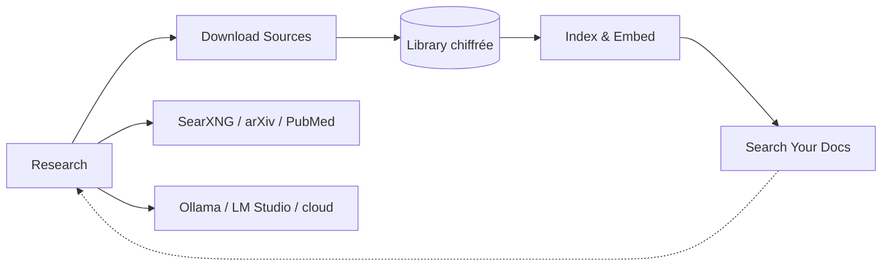

# LearningCircuit/local-deep-research

> Assistant de recherche agentique auto-hébergé, bases chiffrées par utilisateur, LLM local ou cloud.

## Le problème
Les deep research hébergés envoient chaque requête et chaque document sensible chez un tiers, sans que tu voies la chaîne de raisonnement.

## Ce que ça fait vraiment
Pose une question complexe, cherche sur le web, les articles académiques et tes propres documents, puis synthétise avec citations.
Stratégie `langgraph-agent` : le LLM choisit les moteurs (arXiv, PubMed, Semantic Scholar…) et décide quand synthétiser.
Télécharge les sources dans une bibliothèque chiffrée, les indexe, et les rend interrogeables aux sessions suivantes.
Serveur MCP (`ldr-mcp`) pour Claude Desktop et Claude Code, avec 8 outils dont un `search` sans coût LLM.

## Comment c'est branché


## Essayer
```bash
curl -O https://raw.githubusercontent.com/LearningCircuit/local-deep-research/main/docker-compose.yml && docker compose up -d
pip install local-deep-research
python -m local_deep_research.web.app
python -m local_deep_research.benchmarks.cli.benchmark_commands simpleqa --examples 50
```

## Coût et pièges
Gratuit en local mais il faut Ollama et SearXNG à côté ; les résultats annoncés (95,7 % SimpleQA) viennent d'un Qwen3.6-27B sur RTX 3090 avec recherche Serper payante. `--network host` ne marche pas sur Docker Desktop. CPU avec AVX obligatoire.

## Ce que ce n'est pas
Pas un service clé en main : trois conteneurs à faire dialoguer. Le serveur MCP n'a ni authentification ni limitation de débit, réservé au STDIO local. Les benchmarks sont communautaires, sur petits échantillons, avec risque de contamination admis par les auteurs.

## Alternatives
SearXNG LDR-Academic — fork orienté recherche cité comme projet connexe, pas comme substitut.

## Pour toi
Le candidat sérieux pour un deep research privé ; le mode `search` sans coût LLM est parfait pour de la veille récurrente.
