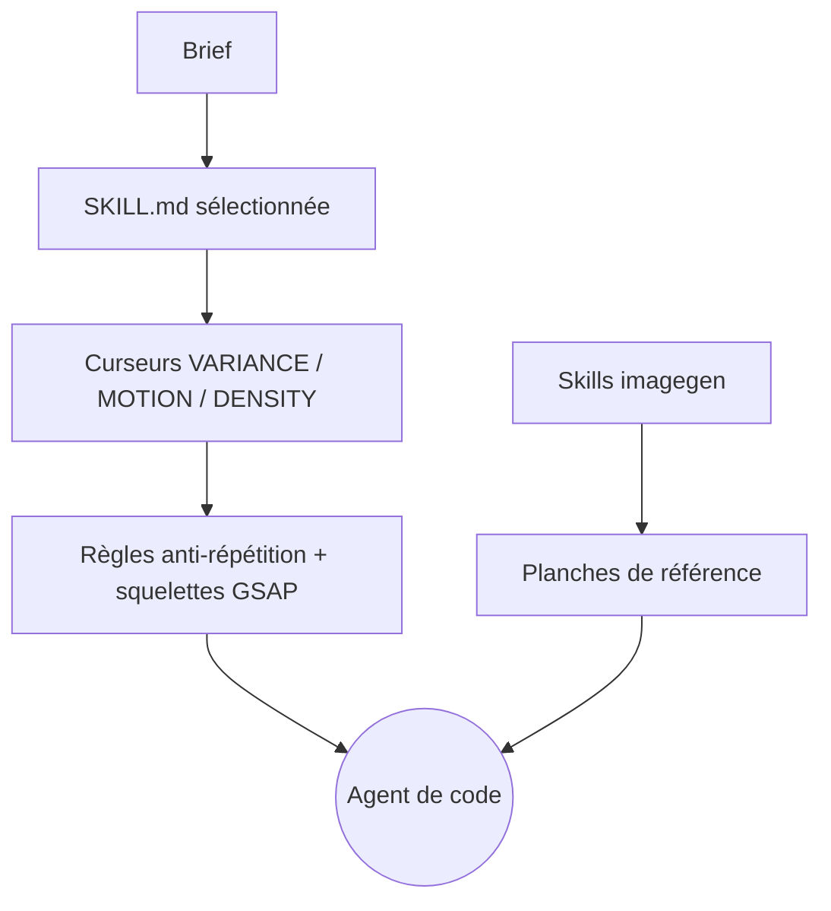

# Leonxlnx/taste-skill

> Skills de direction artistique pour que les interfaces générées par un agent ne se ressemblent pas toutes.

## Le problème
Un agent produit toujours la même interface : centrée, espacée pareil, typographie par défaut.
Le résultat est reconnaissable au premier coup d'œil et sans intention visuelle.

## Ce que ça fait vraiment
Dix skills d'implémentation, chacune avec un parti pris : minimaliste, brutaliste, haut de gamme, strict GPT/Codex.
La skill par défaut lit le brief, en déduit un langage de design et règle trois curseurs de 1 à 10 :
variance de mise en page, intensité de mouvement, densité visuelle.
Trois skills de génération d'images produisent des planches de référence (web, mobile, kit de marque), sans code.

## Comment c'est branché


## Essayer
```bash
npx skills add https://github.com/Leonxlnx/taste-skill
npx skills add https://github.com/Leonxlnx/taste-skill --skill "design-taste-frontend"
npx skills add https://github.com/Leonxlnx/taste-skill --skill "design-taste-frontend-v1"
```

## Coût et pièges
Gratuit. La v2 par défaut est annoncée comme expérimentale et « en itération active » vers une 2.0 stable.
Le nom d'installation diffère du nom de dossier — se tromper installe autre chose.

## Ce que ce n'est pas
Pas un système de design : aucun composant, aucun token, rien de réutilisable entre projets.
Pas de garantie de résultat — c'est du prompt, et la v2 peut casser ce qui marchait en v1.
Aucune licence déclarée dans le README, qui consacre en revanche une section à ses sponsors.

## Alternatives
- `addyosmani/agent-skills` : contient `frontend-ui-engineering`, orientée accessibilité plutôt que style.

## Pour toi
Hors périmètre data/IA, expérimental, sans licence. À ignorer.
