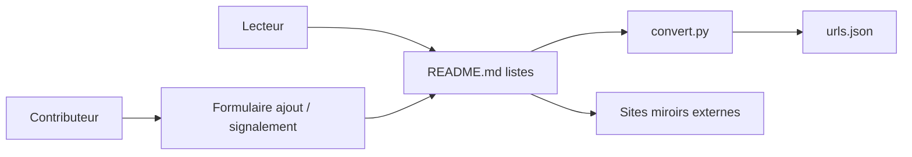

# LiLittleCat/awesome-free-chatgpt

> Liste chinoise de sites miroirs ChatGPT gratuits et d'alternatives, pour utilisateurs sans accès direct.

## Le problème
Accéder à un chatbot type ChatGPT sans compte ni paiement, notamment depuis la Chine.

## Ce que ça fait vraiment
Un tableau de plus de 300 sites miroirs étiquetés (gratuit, avec quota, connexion requise, clé d'API, GPT-4, accès international) avec date d'ajout et remarques, une liste de sites déclarés hors service, puis des sections d'alternatives (Poe, HuggingChat, Gemini, Claude, modèles chinois), d'interfaces auto-hébergeables et d'outils pour développeurs. Un script `convert.py` extrait les URL vers `urls.json`.

## Comment c'est branché

## Essayer
Aucune commande documentée : ouvrir le README et suivre les liens.

## Coût et pièges
Gratuit, mais le README avertit de ne saisir aucune donnée sensible : ce sont des sites tiers non vérifiés. Certaines entrées publient des mots de passe ou codes partagés. Dernier push le 2025-06-23 : beaucoup de liens sont probablement morts.

## Ce que ce n'est pas
Pas un outil ni un service officiel OpenAI. Ces miroirs peuvent journaliser tes prompts ; rien n'est garanti sur la disponibilité ou la légitimité.

## Alternatives
Pour héberger toi-même : lobechat, ChatGPT-Next-Web, chatbot-ui, BetterChatGPT (cités dans le README).

## Pour toi
À ignorer : liste de miroirs tiers à confidentialité inconnue, non mise à jour depuis plus d'un an, sans intérêt pour un profil data/IA/MLOps.
