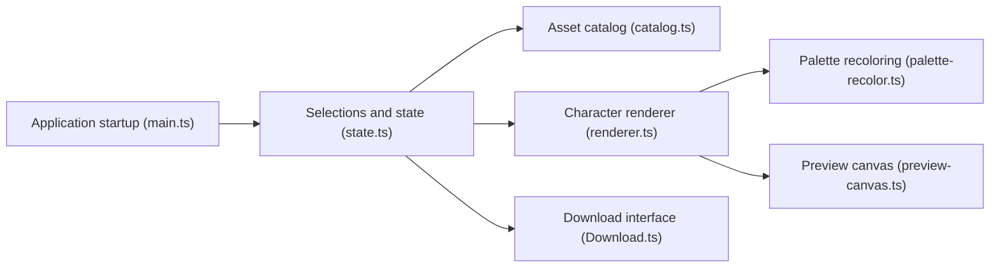

# LiberatedPixelCup/Universal-LPC-Spritesheet-Character-Generator

> Générateur web de personnages en sprites pixel-art LPC, pour développeurs de jeux 2D.

## Le problème
Assembler des personnages cohérents à partir des nombreux éléments LPC (corps, habits, armes) créés par plusieurs artistes.

## Ce que ça fait vraiment
- Sélection par catégories et filtres, rendu du personnage, aperçu de la feuille de sprites et des animations.
- Recoloration par palette via shaders WebGL, avec repli CPU.
- Export ZIP, JSON, et fichier de crédits (CREDITS.csv) pour l'attribution obligatoire.
- Interface en Vite, état synchronisé avec l'URL.

## Comment c'est branché


## Essayer
```bash
npm ci
npm run dev
npm run build
npm run preview
```
Node.js 22.19 minimum.

## Coût et pièges
Gratuit, mais chaque image a sa licence (CC0, CC-BY, CC-BY-SA, OGA-BY, GPL) ; il faut créditer les auteurs. Le README conseille CC0 ou OGA-BY pour publier sur Steam ou l'App Store.

## Ce que ce n'est pas
Pas un outil d'animation. Beaucoup d'éléments ne couvrent pas encore les animations étendues.

## Alternatives
Le README cite pflat.itch.io/lpc-character-generator et vitruvianstudio.github.io.

## Pour toi
À ignorer : outil de création de jeux 2D, hors périmètre data/IA/MLOps.

