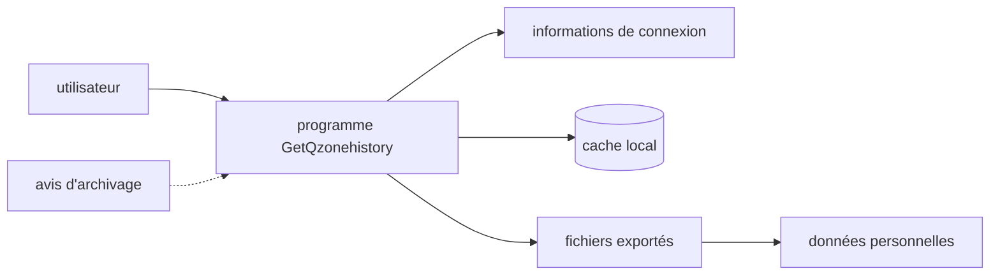

# LibraHp/GetQzonehistory

> **A Qzone history extraction tool, archived: its README is now only a shutdown notice.**

## The problem

The README no longer states any problem solved: all that remains is an archival notice. The
repository name suggests retrieving the history of Qzone accounts, but nothing in the available
material documents it.

## What it actually does

Impossible to establish from the README: no functional description, no options, no output
format. The only content is the announcement that the project is discontinued and archived as
of 4 September 2026, with no functional updates, security fixes or compatibility work, and no
guarantee that the code still runs. The README does mention a local cache, login information
and exported files, which indicates the tool produced exports containing personal data.

## How it is wired



The README names no file and no module: this diagram only reflects the artefacts it explicitly
cites — login information, local cache, exported files — plus the archival notice telling users
to stop the program and delete those artefacts.

## Trying it

```
# no command documented in the README
```

No install or run command is present: the README explicitly advises against installing, running,
distributing or building new work on top of the project.

## Cost and traps

No monetary cost is stated, but the trap lies elsewhere: the project was archived over platform
rules and compliance concerns, no licence is declared, and exports contain personal data. The
README asks users to stop automated tasks, purge cache, credentials and exports, and not to
publish or spread that data.

## What it is not

Not a maintained or usable project: no fixes, security ones included, are planned, and issues or
pull requests may go unanswered. Nor is it a permission to use: the README states that keeping
the repository as a historical record neither recommends nor authorises any manner of use.

## Alternatives

The README names no other project and no neighbours were supplied: no comparable alternative in
the catalogue. It only points generically to "other tools", provided applicable laws, privacy
requirements and platform rules are respected.

## For you

Nothing to salvage for a data / AI / MLOps practice: no documented code, no licence, archived
repository under compliance constraints. Ignore it, star count notwithstanding.
