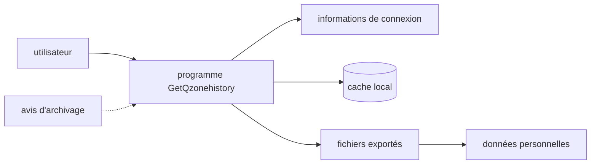

# LibraHp/GetQzonehistory

> **Outil d'extraction d'historique Qzone, archivé : le README ne contient plus qu'un avis d'arrêt.**

## Le problème

Le README ne décrit plus aucun problème résolu : il ne reste qu'une notice d'archivage. Le nom
du dépôt laisse entendre une récupération d'historique de comptes Qzone, mais rien dans la
matière disponible ne le documente.

## Ce que ça fait vraiment

Impossible à établir depuis le README : aucune description fonctionnelle, aucune option,
aucun format de sortie n'y figure. Le seul contenu est l'annonce que le projet est arrêté et
archivé depuis le 4 septembre 2026, sans mise à jour fonctionnelle, correctif de sécurité ni
adaptation de compatibilité, et sans garantie que le code fonctionne encore. Le README
mentionne l'existence d'un cache local, d'informations de connexion et de fichiers exportés,
ce qui indique que l'outil produisait des exports contenant des données personnelles.

## Comment c'est branché



Le README ne nomme aucun fichier ni module : ce schéma ne reprend que les seuls artefacts
qu'il cite explicitement — informations de connexion, cache local, fichiers exportés — et la
notice d'archivage qui recommande d'arrêter le programme et de supprimer ces artefacts.

## Essayer

```
# aucune commande documentée dans le README
```

Aucune commande d'installation ni d'exécution n'est présente : le README recommande
explicitement de ne plus installer, exécuter, distribuer ni développer sur la base du projet.

## Coût et pièges

Pas de coût monétaire indiqué, mais le piège est ailleurs : projet archivé pour des raisons de
règles de plateforme et de conformité, licence non déclarée, exports contenant des données
personnelles. Le README demande d'arrêter les tâches automatisées, de purger cache, identifiants
et exports, et de ne pas diffuser publiquement ces données.

## Ce que ce n'est pas

Ce n'est pas un projet maintenu ni utilisable en l'état : aucune correction, y compris de
sécurité, n'est prévue, et les issues ou pull requests peuvent rester sans réponse. Ce n'est pas
non plus une autorisation d'usage : le README précise que la conservation du dépôt à titre
historique ne recommande ni n'autorise aucun mode d'utilisation.

## Alternatives

Le README ne cite aucun autre projet et aucun voisin n'a été fourni : aucune alternative
comparable dans le catalogue. Il renvoie seulement, de façon générique, vers « d'autres outils »
à condition de respecter lois, exigences de confidentialité et règles de plateforme.

## Pour toi

Rien à récupérer pour un usage data / IA / MLOps : pas de code documenté, pas de licence, projet
archivé et sujet à des contraintes de conformité. À ignorer, malgré le compteur d'étoiles.
