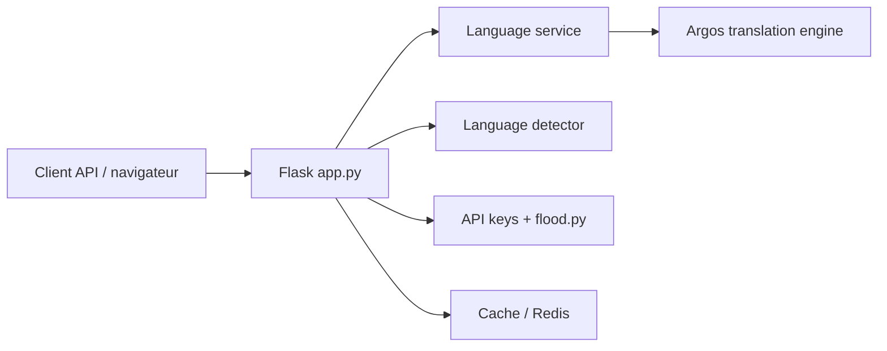

# LibreTranslate/LibreTranslate

> API de traduction automatique open source, entièrement auto-hébergée, basée sur Argos Translate.

## Le problème
Traduire du texte sans envoyer les données à Google ou Azure.

## Ce que ça fait vraiment
README très court (matière insuffisante). D'après le code : application Flask exposant traduction, détection de langue, liste des langues, santé, traduction de fichiers, suggestions et interface web. Au démarrage, les modèles Argos sont initialisés ; un cache, un stockage partagé (Redis), des clés d'API et des contrôles de débit sont disponibles.

## Comment c'est branché

## Essayer
Aucune commande dans le README fourni (renvoi vers Quickstart et Usage Instructions, non lus).

## Coût et pièges
Gratuit ; les modèles occupent de l'espace disque et de la mémoire (non documenté ici). Un déploiement public demande de configurer clés et limites de débit.

## Ce que ce n'est pas
Pas un moteur propriétaire : la qualité dépend d'Argos Translate. Licence AGPL-3.0 : les modifications servies en réseau doivent être publiées. La marque est encadrée (Trademark Guidelines).

## Alternatives
Aucune alternative nommée ; les API Google et Azure sont citées comme ce qu'il remplace.

## Pour toi
À adopter pour une traduction interne sans fuite de données, en gardant en tête la licence AGPL.
