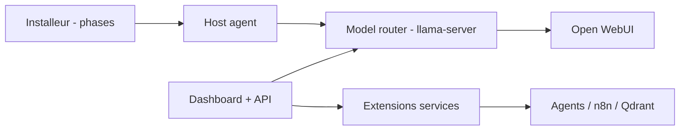

# Light-Heart-Labs/DreamServer

> Installeur qui monte une pile d'IA locale complète (chat, agents, RAG, voix, images) sur son propre matériel.

## Le problème
Assembler à la main Ollama, Open WebUI, n8n, ComfyUI et les outils de confidentialité est long et fragile.

## Ce que ça fait vraiment
ODS détecte le GPU (NVIDIA, AMD Strix Halo, Apple Silicon, Intel Arc, CPU), choisit un modèle, génère les identifiants et démarre des services Docker : llama-server, Open WebUI, LiteLLM, Whisper, Kokoro, n8n, Qdrant, SearXNG, ComfyUI, agent Hermes, tableau de bord et CLI `ods`. Chaque service est une extension (`manifest.yaml` + `compose.yaml`). Un mode nuage (OpenAI, Anthropic, Together) est possible.

## Comment c'est branché


## Essayer
```bash
curl -fsSL https://install.osmantic.com/ods.sh | bash
```
```bash
ods status
ods model swap T3
```

## Coût et pièges
Docker requis, disque et VRAM selon le modèle. L'installation par `curl | bash` télécharge la branche `main` : le README conseille de fixer une version taguée (v2.6.0 stable). 3 782 issues ouvertes.

## Ce que ce n'est pas
Pas une solution éprouvée en production : `main` évolue vite. Les performances doivent être mesurées localement selon le README.

## Alternatives
Ollama + Open WebUI, LocalAI, AnythingLLM, kits de démarrage n8n (comparés dans le README).

## Pour toi
À surveiller : pratique pour un labo d'IA privé en une commande, mais fixe une version et audite le script avant de l'exposer.
