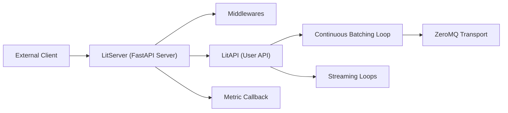

# Lightning-AI/LitServe

> Bibliothèque pour bâtir des serveurs d'inférence sur mesure en Python : modèles, agents, RAG ou pipelines.

## Le problème
Les serveurs de modèles usuels imposent des abstractions rigides et gênent dès qu'on veut plusieurs modèles, des agents ou une logique de traitement non standard.

## Ce que ça fait vraiment
On écrit une classe `LitAPI` (méthodes `setup`, `predict`, éventuellement décodage et encodage) et un `LitServer` la sert au-dessus de FastAPI. La bibliothèque gère le traitement par lots, le streaming, la concurrence multi-workers, le GPU et la compatibilité OpenAI. D'après le code, des boucles (`continuous_batching_loop.py`, `streaming_loops.py`), des transports (ZeroMQ, processus), des middlewares et des callbacks de métriques structurent l'ensemble.

## Comment c'est branché


## Essayer
```bash
pip install litserve
python server.py
curl -X POST http://127.0.0.1:8000/predict -H "Content-Type: application/json" -d '{"input": 4.0}'
lightning deploy server.py --cloud
```

## Coût et pièges
Le mode auto-hébergé est gratuit ; l'authentification, l'autoscaling GPU et l'observabilité sont marqués « à faire soi-même » hors de l'offre Lightning Cloud (niveau gratuit, puis paiement à l'usage, H100 à partir de 1,75 $). Le README annonce un SLA de 99,995 % puis de 99,95 % : incohérence à noter. Les gains « 2× FastAPI » sont ceux de l'éditeur.

## Ce que ce n'est pas
Ce n'est pas une alternative clé en main à vLLM ou Ollama, comme le README le dit lui-même : pas de cache KV ni d'optimisations LLM intégrés. Une partie des tableaux de fonctions décrit l'offre payante, pas la bibliothèque.

## Alternatives
- vLLM : à préférer pour servir un LLM avec optimisations prêtes ; intégrable dans LitServe.
- Ollama : à préférer pour un LLM local simple.
- TorchServe : comparé dans les benchmarks de l'éditeur.

## Pour toi
À adopter pour exposer un pipeline d'inférence non standard (multi-modèles, agent, RAG) avec un contrôle fin : la bibliothèque est sous Apache-2.0 et utilisable sans le cloud de l'éditeur.
