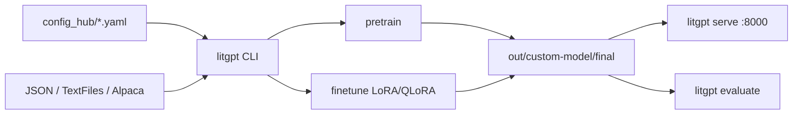

# Lightning-AI/litgpt

> Plus de 20 LLM réimplémentés sans abstractions, avec recettes de pré-entraînement et fine-tuning.

## Le problème
Lire le code d'un LLM dans une bibliothèque générique oblige à traverser cinq couches d'abstraction
avant d'atteindre l'attention.

## Ce que ça fait vraiment
Chaque modèle est réécrit de zéro en fichier unique : Llama 2/3.x, Gemma 1/2/3, Phi 1.5 à 4, Qwen2.5
et Qwen3 (dont MoE), Mistral, Mixtral, Falcon, OLMo, Pythia, SmolLM2, TinyLlama, R1 Distill… Une CLI
unique enchaîne `download`, `pretrain`, `finetune`, `chat`, `evaluate` et `serve`. Le fine-tuning
couvre LoRA, QLoRA, Adapter et Adapter v2 ; la quantification descend en 4 bits (`bnb.nf4`) ; FSDP,
Flash Attention v2, offload CPU et TPU/XLA sont pris en charge. Les recettes sont des YAML validés,
chargeables directement par URL.

## Comment c'est branché


## Essayer
```bash
pip install 'litgpt[extra]'
litgpt download list
litgpt finetune microsoft/phi-2 --data JSON --data.json_path my_custom_dataset.json --data.val_split_fraction 0.1 --out_dir out/custom-model
litgpt chat out/custom-model/final
litgpt serve out/custom-model/final
litgpt evaluate microsoft/phi-2 --tasks 'truthfulqa_mc2,mmlu'
```

## Coût et pièges
Le code est Apache 2.0 et gratuit ; le GPU ne l'est pas, et le README pousse assez explicitement
Lightning Cloud (« GPUs from $0.19 »). Le téléchargement de certains modèles exige un jeton d'accès
Hugging Face. Les poids des gros modèles se comptent en dizaines de gigaoctets.

## Ce que ce n'est pas
Ce n'est pas un serveur d'inférence optimisé pour la production à grande échelle façon vLLM :
`litgpt serve` monte un serveur web simple. Ce n'est pas non plus une bibliothèque à composer —
l'absence d'abstraction, qui en fait la lisibilité, en fait aussi la rigidité.

## Alternatives
Le README cite ses parents plutôt que des concurrents : Lit-LLaMA et nanoGPT de @karpathy, dont
LitGPT est l'extension, et l'Evaluation Harness d'EleutherAI pour l'évaluation.

## Pour toi
Le bon dépôt pour lire une implémentation d'attention sans indirection, et pour un fine-tuning LoRA
reproductible à partir d'un YAML.
