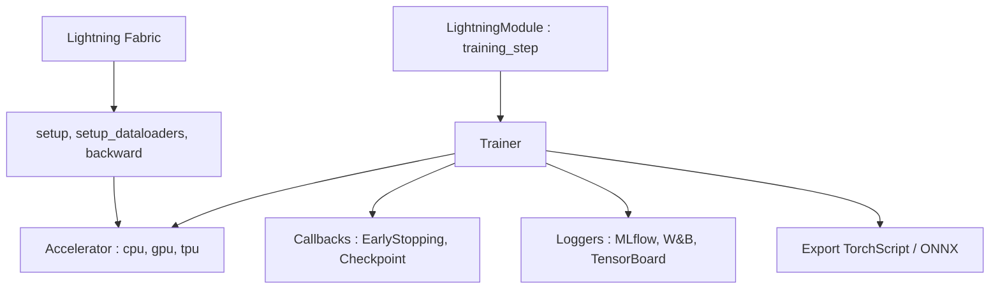

# Lightning-AI/pytorch-lightning

> Organisation du code PyTorch : la science reste à vous, l'ingénierie d'entraînement est automatisée.

## Le problème
En PyTorch nu, il faut réécrire à chaque projet la boucle d'entraînement, la rétropropagation, la précision mixte, le multi-GPU et le distribué.
Ce code se réimplémente partout et se trompe souvent.

## Ce que ça fait vraiment
Deux paquets : PyTorch Lightning (LightningModule + Trainer) pour l'entraînement structuré, et Lightning Fabric pour garder le contrôle expert sur sa propre boucle.
Le passage de 8 à 256 GPU, ou de GPU à TPU, se fait en changeant les arguments du `Trainer`, sans toucher au code du modèle ; `precision=16` pour la précision mixte.
Callbacks intégrés : EarlyStopping, ModelCheckpoint ; loggers TensorBoard, Weights & Biases, Comet, MLflow et d'autres ; export TorchScript et ONNX.
Fabric : `fabric.setup(model, optimizer)`, `fabric.setup_dataloaders(...)`, `fabric.backward(loss)` remplacent la gestion manuelle du device, avec stratégies DDP, FSDP, DeepSpeed.

## Comment c'est branché


## Essayer
```bash
pip install lightning
pip install lightning['extra']
conda install lightning -c conda-forge
python main.py
```

## Coût et pièges
Gratuit ; le README pousse Lightning Cloud comme service de GPU géré avec palier gratuit, mais l'exécution sur votre matériel reste possible.
Surcoût de vitesse annoncé faible (environ 300 ms par époque par rapport à PyTorch pur) : à vérifier sur vos boucles courtes.

## Ce que ce n'est pas
Ce n'est pas une abstraction qui vous enlève PyTorch : un LightningModule reste un `nn.Module`.
Ce n'est pas un serveur d'inférence : le README renvoie vers LitServe pour servir les modèles.
Ce n'est pas un AutoML ni un gestionnaire d'expériences : il s'intègre à MLflow ou W&B, il ne les remplace pas.

## Alternatives
- LitServe — cité pour le service d'inférence, pas pour l'entraînement.
- PyTorch nu — reste le point de comparaison du README ; plus de contrôle, beaucoup plus de code répétitif.

## Pour toi
Le standard de fait pour structurer un entraînement PyTorch : à adopter dès qu'un projet dépasse le notebook.
