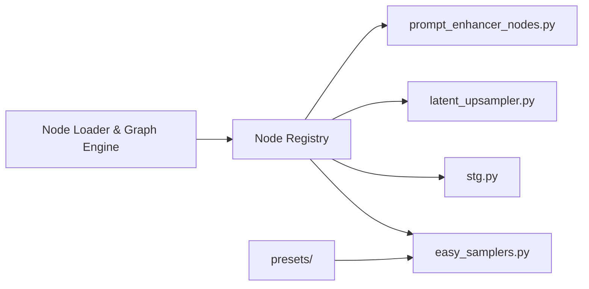

# Lightricks/ComfyUI-LTXVideo

> Nœuds ComfyUI et workflows pour piloter le modèle vidéo LTX-2 : texte, image, audio, LoRA de contrôle.

## Le problème
Le modèle LTX-2 est déjà intégré au cœur de ComfyUI, mais ses fonctions avancées (LoRA de contrôle, upscalers, HDR, doublage) demandent des nœuds et graphes dédiés.

## Ce que ça fait vraiment
Le dépôt ajoute à ComfyUI des nœuds d'échantillonnage (`easy_samplers.py`, `tiled_sampler.py`, `recurrent_sampler.py`), de guidage (`stg.py`), d'amélioration de prompt et de suréchantillonnage latent, avec des workflows d'exemple dans `example_workflows/`. Il couvre texte ou image vers vidéo, LoRA (profondeur, pose, contours, suivi de mouvement, HDR avec export EXR, doublage Dub-It, upscale 2× et 4×) et texte vers audio. Les nœuds sont enregistrés par `nodes_registry.py`.

## Comment c'est branché


## Essayer
```bash
pip install openimageio
python -m main --reserve-vram 5
```
L'installation courante passe par ComfyUI Manager : Ctrl+M, « Install Custom Nodes », chercher « LTXVideo », puis redémarrer.

## Coût et pièges
Prérequis annoncés : GPU CUDA de 32 Go de VRAM ou plus et plus de 100 Go de disque. Les poids (checkpoint 22B, upscalers, LoRA, encodeur Gemma 3) se téléchargent à part, en dizaines de Go. Le README mélange les versions LTX-2.0, 2.3 et 2.5 : vérifier le workflow correspondant à ton checkpoint. Licence présente mais non identifiée par GitHub.

## Ce que ce n'est pas
Ce n'est pas un logiciel autonome : il exige ComfyUI. Ce n'est pas non plus utilisable sur un GPU modeste sans les nœuds à faible VRAM et un compromis de vitesse. Le README ne donne aucun benchmark.

## Alternatives
Aucune alternative nommée dans le README.

## Pour toi
À surveiller : intéressant si tu génères de la vidéo avec ComfyUI et disposes d'un GPU de 32 Go, mais ce n'est pas un outil data ou MLOps courant, et la licence est à vérifier.
