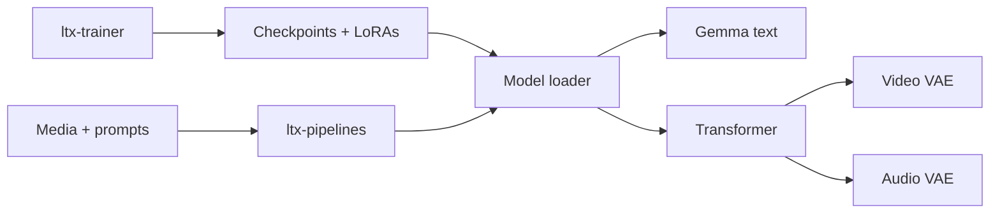

# Lightricks/LTX-2

> Modèle de fondation DiT de Lightricks générant vidéo et audio synchronisés, avec pipelines et trainer.

## Le problème
Générer une vidéo avec son synchronisé demande d'habitude plusieurs modèles distincts et beaucoup d'assemblage.

## Ce que ça fait vraiment
Monorepo en trois paquets : `ltx-core` (transformer DiT, VAE vidéo et audio, upscaler, encodeur texte Gemma, quantification FP8, streaming de blocs), `ltx-pipelines` (texte/image vers vidéo, audio vers vidéo, interpolation de keyframes, retake, HDR, doublage) et `ltx-trainer` (LoRA, fine-tuning complet, IC-LoRA). Pipeline distillé rapide ou DFR qualité production.

## Comment c'est branché


## Essayer
```bash
git clone https://github.com/Lightricks/LTX-2.git
cd LTX-2
uv sync --extra natten
hf auth login
uv run python -m ltx_pipelines.distilled --output-path output.mp4 --prompt "..."
```

## Coût et pièges
Environ 66 Gio de poids à télécharger, dépôt Hugging Face à accès restreint (compte, token « read gated repos »). Transformer 22B : gros GPU, sinon `--quantization fp8-cast --offload`.

## Ce que ce n'est pas
Pas un service clé en main : licence non identifiée par GitHub, à lire avant tout usage commercial. Les fichiers LTX-2.3 et LTX-2.5 ne sont pas interchangeables.

## Alternatives
Aucune alternative nommée ; une intégration ComfyUI est mentionnée.

## Pour toi
À surveiller : modèle vidéo+audio ouvert et bien outillé (trainer inclus), mais la licence à vérifier et le coût matériel (66 Gio, 22B) le réservent à un vrai besoin de génération vidéo.
