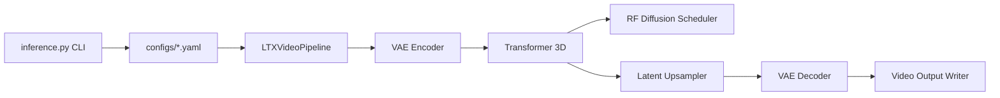

# Lightricks/LTX-Video

> Modèle de génération vidéo DiT (texte/image vers vidéo) avec code d'inférence PyTorch.

## Le problème
Générer ou étendre des vidéos conditionnées par images et keyframes exige des modèles lourds, peu ouverts et difficiles à piloter.

## Ce que ça fait vraiment
Fournit `inference.py` et le paquet `ltx_video` : image→vidéo, extension avant/arrière, conditionnement multiple (images + segments vidéo).
Variantes 2B et 13B, distillées et FP8, configurées par YAML ; upscalers spatial/temporel.
Pipeline : encodeur VAE, transformer 3D débruitant avec scheduler RF, upsampler latent, décodeur VAE.
Intégrations ComfyUI (recommandée) et Diffusers. Le développement principal a migré vers LTX-2.

## Comment c'est branché


## Essayer
```bash
git clone https://github.com/Lightricks/LTX-Video.git
cd LTX-Video
python -m venv env
source env/bin/activate
python -m pip install -e .\[inference\]
python inference.py --prompt "PROMPT" --conditioning_media_paths IMAGE_PATH --conditioning_start_frames 0 --height HEIGHT --width WIDTH --num_frames NUM_FRAMES --seed SEED --pipeline_config configs/ltxv-13b-0.9.8-distilled.yaml
```

## Coût et pièges
GPU CUDA requis (testé CUDA 12.2) ; le 13B demande beaucoup de VRAM. Poids sous licence OpenRail-M (usage commercial encadré), distincte du code Apache.

## Ce que ce n'est pas
Pas la dernière génération : LTX-2 (audio+vidéo) vit ailleurs. `inference.py` est moins fidèle que le workflow ComfyUI, de l'aveu du README.

## Alternatives
- ComfyUI-LTXVideo : workflows recommandés pour la meilleure qualité.
- LTX-VideoQ8 : version 8 bits pour GPU Ada avec peu de VRAM.
- TeaCache4LTX-Video : accélération d'inférence sans réentraînement.

## Pour toi
À surveiller : base ouverte et documentée pour expérimenter la génération vidéo et le fine-tuning LoRA, mais l'effort part désormais sur LTX-2.
