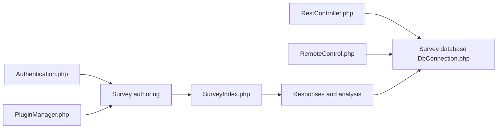

# LimeSurvey/LimeSurvey

> Plateforme PHP auto-hébergeable de création et d'analyse d'enquêtes en ligne, pour équipes, chercheurs et administrations.

## Le problème
Collecter des réponses structurées (clients, études, RH) sans confier les données à un SaaS fermé ni payer par nombre de questionnaires.

## Ce que ça fait vraiment
Éditeur de questionnaires avec plus de 30 types de questions, logique conditionnelle et branchements, thèmes personnalisables, multilingue. Partage par lien public, QR code ou invitation nominative. Réponses et statistiques intégrées, API RemoteControl (XML-RPC / JSON-RPC) et REST, plugins (export R, Stata, authentification CAS, SAML, LDAP). Authentification à deux facteurs.

## Comment c'est branché


## Essayer
Aucune commande : le README renvoie au téléchargement de la version stable.
```bash
# non documenté dans le README : télécharger la release stable
# prérequis : PHP >= 8.1.29 (mbstring, PDO), MySQL >= 8.0 / PostgreSQL >= 14 / MariaDB >= 10.3.38 / MSSQL >= 2019
```

## Coût et pièges
Logiciel gratuit, mais il faut un serveur web, PHP et une base de données à maintenir. Une offre SaaS payante existe pour ne pas héberger soi-même.

## Ce que ce n'est pas
Pas un outil d'analyse statistique poussée : il collecte et résume. Le dépôt de développement peut contenir des versions peu testées. La licence n'est pas identifiée par GitHub.

## Alternatives
Aucune alternative nommée dans le README.

## Pour toi
À surveiller : utile si tu dois monter une enquête auto-hébergée avec export R/Stata, mais c'est du PHP classique sans lien avec ton stack ML, et la licence est à vérifier avant tout usage.
