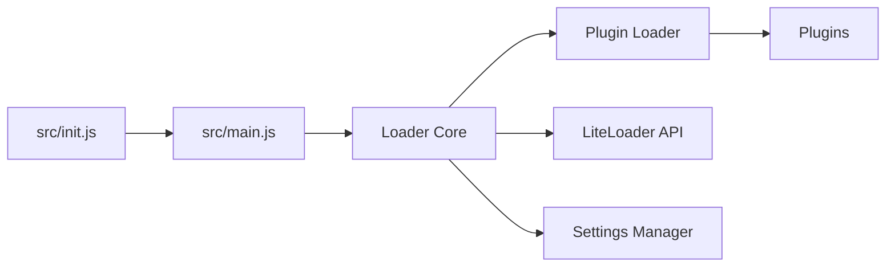

# LiteLoaderQQNT/LiteLoaderQQNT

> Chargeur de plugins pour le client de messagerie QQNT, archivé, README en chinois.

## Le problème
QQNT n'offre pas de système d'extensions pour changer l'apparence ou ajouter des fonctions.

## Ce que ça fait vraiment
Se greffe au démarrage de QQNT (modification de `package.json` pour pointer vers un lanceur) et charge des plugins depuis un dossier `plugins`, avec page de réglages, API exposée aux plugins et schéma de protocole. L'installation demande un `dbghelp.dll` non public ou un patch du fichier QQNT.dll pour contourner la vérification.

## Comment c'est branché


## Essayer
```bash
git clone --depth 1 https://github.com/LiteLoaderQQNT/LiteLoaderQQNT.git
```
Puis modification manuelle de `package.json` de QQNT, non scriptée.

## Coût et pièges
Le dépôt est archivé. Le README avertit que QQ peut le considérer comme un « outil illégal », déconnecter l'appareil ou bannir le compte.

## Ce que ce n'est pas
Pas une extension officielle ni maintenue. Nécessite de contourner la vérification d'intégrité du client.

## Alternatives
Aucune alternative nommée dans le README.

## Pour toi
À ignorer : projet archivé qui contourne la vérification d'un client de messagerie chinois, avec risque de bannissement et aucun usage data/IA/MLOps.

