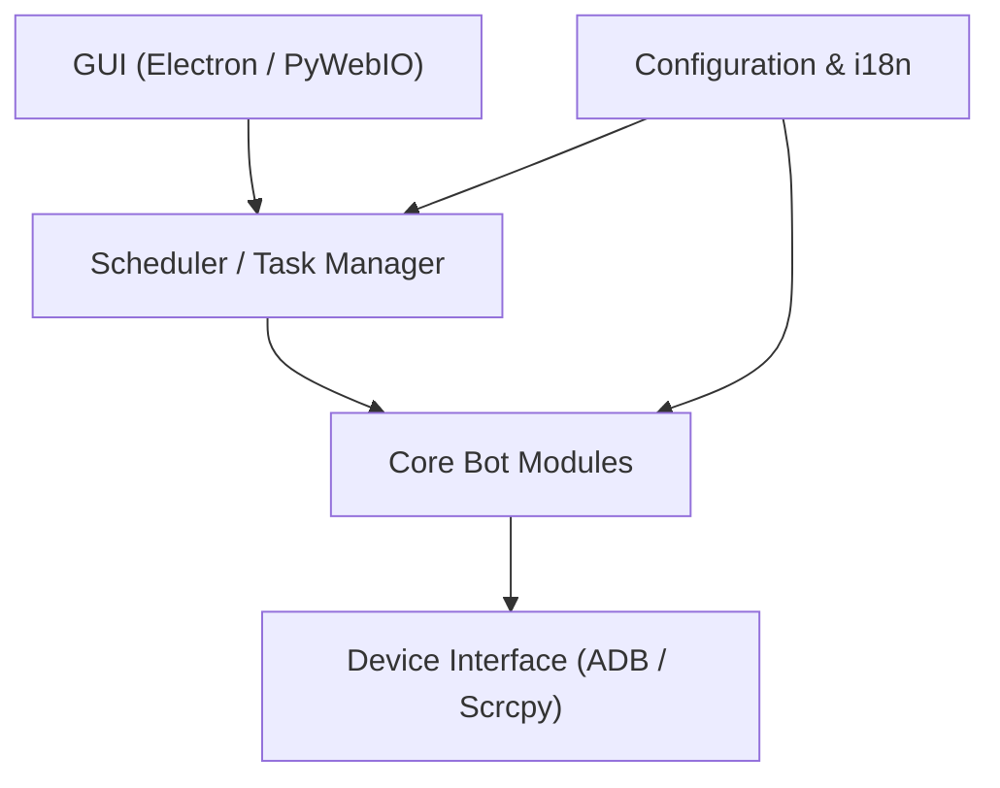

# LmeSzinc/AzurLaneAutoScript

> Robot d'automatisation du jeu mobile Azur Lane, pour joueurs voulant déléguer les tâches répétitives.

## Le problème
Le jeu impose des tâches quotidiennes répétitives (sorties, commissions, recherche, boutiques) qui prennent du temps.

## Ce que ça fait vraiment
Pilote un émulateur ou un appareil via ADB/scrcpy. Un ordonnanceur lance des tâches indépendantes et fixe leur prochaine exécution (par exemple après une recherche de 4 heures). Gère l'humeur des personnages, la carte du monde et une reconnaissance de carte plus fine que la simple correspondance de gabarits. Interface web (PyWebIO / Electron).

## Comment c'est branché

## Essayer
Le README ne donne pas de commande : il renvoie à un tutoriel d'installation externe. Aucune commande reprise.

## Coût et pièges
Gratuit, licence GPL-3.0 (copyleft). Nécessite d'aligner de nombreux réglages en jeu et n'absorbe pas les coupures réseau. Automatiser un jeu peut violer ses conditions d'utilisation.

## Ce que ce n'est pas
Pas un outil général d'automatisation ni de test d'applications : il est propre à Azur Lane.

## Alternatives
StarRailCopilot (jeu Honkai Star Rail), MaaAssistantArknights (Arknights) et FGO-py (Fate/Grand Order), cités comme projets liés.

## Pour toi
À ignorer : outil de jeu sans lien avec ton métier ; seule la reconnaissance de carte pourrait intéresser en vision, mais rien ne le justifie.

