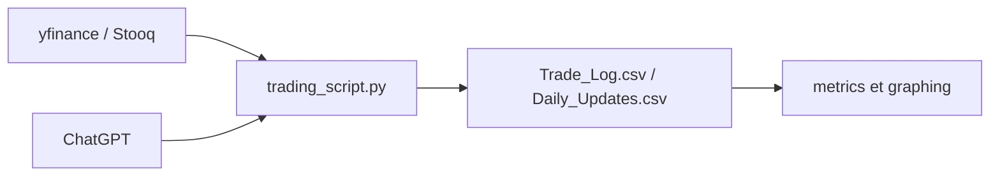

# LuckyOne7777/ChatGPT-Micro-Cap-Experiment

> Expérience de six mois où ChatGPT gère un portefeuille micro-cap réel, avec journaux et évaluation.

## Le problème
Les promesses d'IA « qui choisit les actions » ne sont presque jamais testées avec transparence.

## Ce que ça fait vraiment
Publie les journaux de trades, mises à jour quotidiennes en CSV, recherches hebdomadaires et une évaluation de 40 pages. Le script `trading_script.py` applique un stop-loss automatique, compare au S&P 500 et au Russell 2000, calcule Sharpe, Sortino, CAPM et drawdown. Données via yfinance, repli Stooq. Le cadre réutilisable est renvoyé vers LIBB.

## Comment c'est branché


## Essayer
```bash
# Aucune commande documentée dans le README (dépendances dans requirements.txt)
```

## Coût et pièges
Les décisions viennent de ChatGPT, à ta charge. Aucune licence déclarée : réutilisation juridiquement incertaine. Argent réel en jeu dans l'expérience originale.

## Ce que ce n'est pas
Pas un conseil financier ni une stratégie éprouvée : c'est une expérience.

## Alternatives
LIBB (LLM Investor Behavior Benchmark), cadre de l'auteur cité dans le README.

## Pour toi
Surveiller : bon cas d'étude d'évaluation de LLM en décision, à lire plutôt qu'à exécuter, sans licence claire.

