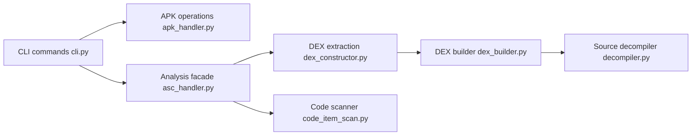

# MG1937/ASC

> Outil en ligne de commande qui décompile des classes d'APK Android à la demande, sans indexation préalable.

## Le problème
Les décompilateurs classiques gonflent l'APK, consomment gigaoctets et minutes pour construire des index avant la première recherche.

## Ce que ça fait vraiment
Traite l'APK comme une base en lecture seule. Localise une classe, extrait un DEX en mémoire, reconstruit un DEX minimal puis le décompile. Recherche de références (chaîne, type, méthode, champ) sur tous les DEX, listage des classes, décodage du manifeste. Le README annonce 1,79 s de recherche globale et 177 ms de décompilation sur un APK de 352 Mo avec 141 Mo de RAM (chiffres non vérifiés). Interface graphique en option.

## Comment c'est branché


## Essayer
```bash
pip install droidasc
droidasc getclass app.apk com.poc.Main -o Main.java
droidasc listclass app.apk --prefix com.poc
droidasc getmanifest app.apk -o AndroidManifest.xml
droidasc findrefs app.apk string token -o string_refs.txt
```

## Coût et pièges
Gratuit, installation via PyPI. Le repo a été créé en juin 2026 et présenté à Black Hat Europe Arsenal. Les gains dépendent du comportement du compilateur R8 : APK non optimisés à tester.

## Ce que ce n'est pas
Pas un outil de désobfuscation ni d'analyse dynamique. Il extrait le code d'un APK ; l'usage doit rester dans un cadre autorisé.

## Alternatives
Androguard est utilisé en interne d'après le schéma, mais le README ne nomme aucune alternative.

## Pour toi
À surveiller : hors de ton domaine data/IA, utile seulement si tu analyses des APK ; sa démarche « requêter l'artefact sans prétraitement » est intéressante mais récente et portée par une personne.
