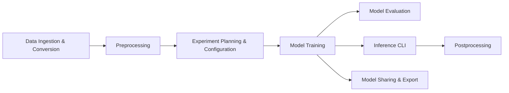

# MIC-DKFZ/nnUNet

> Framework de segmentation sémantique qui configure automatiquement un pipeline U-Net pour chaque jeu d'images.

## Le problème
Chaque nouveau jeu d'images médicales demande de régler à la main prétraitement, architecture et entraînement, sans point de départ fiable.

## Ce que ça fait vraiment
nnU-Net analyse les données, calcule une « empreinte » du jeu, en déduit des configurations U-Net 2D/3D (et une cascade si utile), puis enchaîne prétraitement (recadrage, rééchantillonnage, normalisation), entraînement, sélection de modèle, inférence par fenêtre glissante, post-traitement et ensembles. Supporte 2D et 3D, canaux arbitraires, plusieurs formats. v2 est une réécriture complète.

## Comment c'est branché


## Essayer
```bash
pip install nnunetv2
```

## Coût et pièges
Gratuit ; installer d'abord PyTorch adapté à ton matériel et définir `nnUNet_raw`, `nnUNet_preprocessed`, `nnUNet_results`. Entraînement 3D gourmand en GPU.

## Ce que ce n'est pas
Pas un outil de détection ou de classification : uniquement de la segmentation sémantique supervisée. Pas conçu pour réutiliser des modèles pré-entraînés sur images naturelles.

## Alternatives
Aucune alternative nommée ; la branche v1 reste disponible pour l'ancienne version.

## Pour toi
À adopter dès qu'un projet touche à la segmentation d'images (médicales ou non standard) : c'est la baseline de référence, auto-configurée, maintenue par le DKFZ et contre laquelle toute méthode sera jugée.
