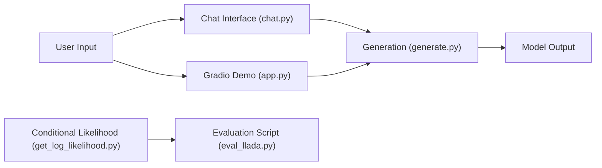

# ML-GSAI/LLaDA

> Modèle de langage de 8 milliards de paramètres fondé sur la diffusion masquée plutôt que l'autorégression, pour chercheurs.

## Le problème
Les LLM prédisent le mot suivant ; cette famille explore une autre façon de modéliser le langage, par diffusion masquée.

## Ce que ça fait vraiment
Le dépôt fournit le code d'inférence pour LLaDA-8B-Base et LLaDA-8B-Instruct (poids sur Hugging Face) : `generate.py` (génération), `get_log_likelihood.py` (vraisemblance), `chat.py` (conversation) et une démo Gradio (`app.py`). Il inclut le code d'évaluation (lm-evaluation-harness). Les nouveautés annoncées : LLaDA-V, LLaDA 1.5, LLaDA-MoE et iLLaDA. Le code d'entraînement et les données ne sont pas publiés ; le README renvoie à `GUIDELINES.md` et à SMDM.

## Comment c'est branché


## Essayer
```bash
pip install transformers==4.38.2
pip install gradio
python app.py
python chat.py
```

## Coût et pièges
GPU nécessaire pour un modèle de 8B. Le chargement passe par `trust_remote_code=True`. La version de `transformers` est figée à 4.38.2. Le catalogue indique aucune licence pour le dépôt : les droits sur le code ne sont pas déclarés. La génération est plus lente qu'un modèle autorégressif : contexte fixe, pas de cache KV, performance optimale quand le nombre de pas égale la longueur de la réponse.

## Ce que ce n'est pas
Ce n'est pas un modèle prêt à servir en production : le README reconnaît une vitesse d'échantillonnage inférieure. Le modèle répond « Bailing » à « Qui es-tu ? », ses données d'entraînement portant des marqueurs d'identité.

## Alternatives
- SMDM : cadre d'entraînement ouvert au procédé proche, cité par le README pour entraîner sa propre variante.

## Pour toi
À surveiller : c'est un signal de recherche sur les LLM à diffusion, mais lent, sans code d'entraînement et sans licence déclarée sur le dépôt : réserve-le à l'exploration.
