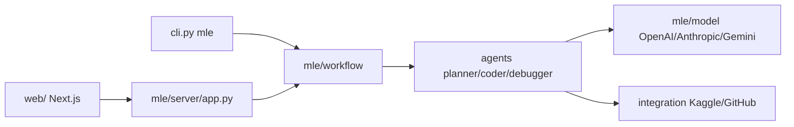

# MLSysOps/MLE-agent

> Agent LLM en ligne de commande qui assiste les ingénieurs ML : baselines, Kaggle, débogage, rapports.

## Le problème
Monter un baseline ML, corriger son code et résumer sa semaine de travail sont des tâches répétitives qu'on voudrait déléguer à un assistant.

## Ce que ça fait vraiment
Le paquet `mle` propose `mle new`, `mle start` (prototype un baseline), `mle chat`, `mle kaggle` (y compris `--auto`) et `mle report` / `report-local` (rapport depuis GitHub ou un dépôt local). Des agents spécialisés (conseiller, planificateur, codeur, débogueur, résumeur) sont pilotés par des workflows, avec un serveur HTTP et un front Next.js pour les rapports. Plusieurs fournisseurs LLM sont pris en charge.

## Comment c'est branché


## Essayer
```bash
pip install -U mle-agent
mle new <project name>
cd <project name>
mle start
mle chat
```

## Coût et pièges
Gratuit, mais les appels LLM sont à ta charge (clé d'un fournisseur). Le mode Kaggle exige d'avoir rejoint la compétition et de fournir jeux de données et fichier de soumission.

## Ce que ce n'est pas
Pas un substitut d'ingénieur : code généré par LLM à relire. Les jalons du README s'arrêtent à septembre 2024 alors que le dépôt a été poussé en 2026 : documentation possiblement en retard.

## Alternatives
Aucune alternative nommée dans le README.

## Pour toi
À surveiller : l'idée est proche de ton métier, mais l'agent est expérimental et son README ne reflète pas l'état récent du code.
