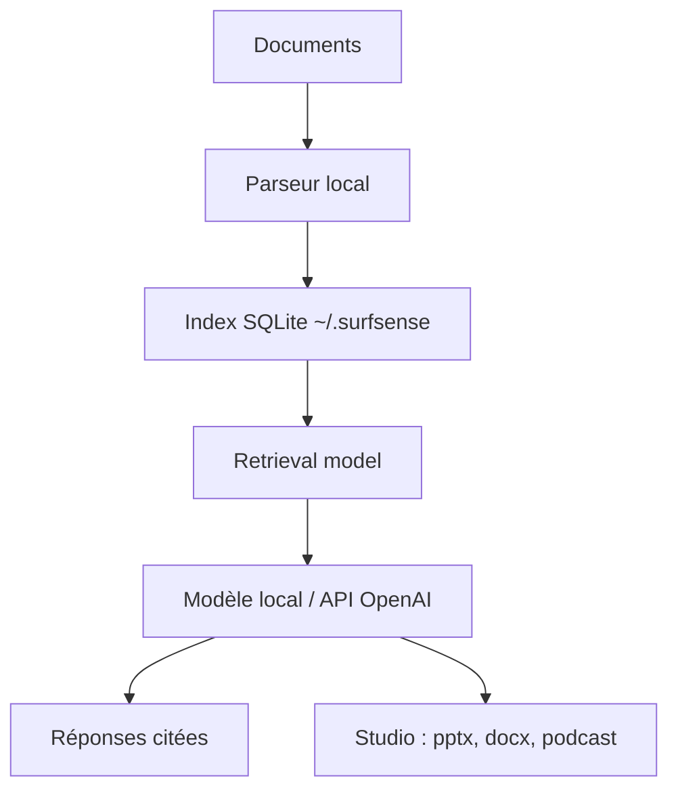

# MODSetter/SurfSense

> Alternative de bureau à NotebookLM, hors ligne : questions sourcées et livrables tirés de tes documents.

## Le problème
Les documents confidentiels ne peuvent pas partir sur NotebookLM. Les outils de chat locaux, eux, ne produisent pas de livrables finis.

## Ce que ça fait vraiment
Le parsing, le découpage et l'embedding se font en local, dans SQLite sous `~/.surfsense`.
Les réponses citent leurs sources. Le module Studio produit résumés, fiches, quiz, cartes mentales, `.pptx`, `.docx`, `.xlsx` et podcasts (Kokoro-82M en local).
On choisit un modèle local (Qwen3) ou n'importe quelle API compatible OpenAI. Les sorties réseau sont coupées par défaut et il n'y a aucune télémétrie.
L'application web hébergée ferme le 18 octobre 2026.

## Comment c'est branché
Le diagramme fourni décrit l'ancienne architecture web (FastAPI, pgvector). Le schéma ci-dessous suit le README 2.0.

## Essayer
Le README ne donne aucune commande : l'installation passe par des installateurs Windows, macOS et Linux.

## Coût et pièges
L'application est gratuite. L'installateur est lourd parce qu'il embarque les modèles. Un modèle local exige une machine qui tient la charge.

## Ce que ce n'est pas
Ce n'est pas un service d'équipe. La vidéo n'est pas encore prise en charge. Le README annonce Apache-2.0, mais GitHub ne l'identifie pas.

## Alternatives
- Jan, AnythingLLM, Open WebUI, LM Studio : pour discuter avec un modèle local, sans livrables.
- NotebookLM : meilleur en audio et en vidéo, mais les documents sont envoyés chez Google.

## Pour toi
À surveiller : le RAG local avec citations et génération de livrables répond à un vrai besoin sur des données sensibles, mais la version 2.0 vient tout juste de sortir.
