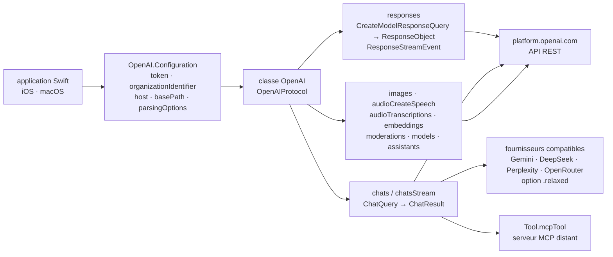

# MacPaw/OpenAI

> **A Swift client for the OpenAI API, for people shipping Apple apps who want types instead of JSON.**

## The problem

Calling the OpenAI API from an iOS or macOS app without a library means writing the `Codable`
structures of every endpoint yourself, plus server-sent-event stream decoding, multipart
uploads for audio and image files, and request cancellation. That work has to be redone at
every API change — and the README makes the point directly: the shape of the Responses API
`output` field is not the one you would guess, and reading `output[0].content[0].text` is not
safe.

## What it actually does

It is a Swift transcription of OpenAI's published REST reference, described in the README's
first line as a "community-maintained implementation" and hosted under the MacPaw account. The
`OpenAI` class is the entry point; you initialise it with a token, optionally an organization
identifier and a `timeoutInterval`, and `OpenAI.Configuration` also exposes `host`, `basePath`,
`port`, `scheme` and `customHeaders`.

The table of contents spans the Responses API (`client.responses`, with
`CreateModelResponseQuery` and a stream of `ResponseStreamEvent`), Chat Completions
(`chats(query:)`, `chatsStream(query:)`), function calling, images (create, edit, variation),
audio (speech synthesis including streaming, transcriptions, translations), structured outputs,
embeddings, moderations, listing and retrieving models, and the Assistants family marked beta
(assistants, threads, runs, file upload). Remote MCP tools are represented by `Tool.mcpTool`,
with `serverLabel`, `serverUrl`, `headers`, `allowedTools` and `requireApproval`.

Every call comes in three shapes: closures (returning a `CancellableRequest` to keep if you
want to cancel), Combine (`sink`, `cancel()`) and structured concurrency (`try await`,
`for try await`, cancellation via `task.cancel()`). Model identifiers are just a
`typealias Model = String` extended with constants (`gpt5`, `gpt5_mini`, `gpt4_o`, `gpt4_1`,
`whisper_1`…). A `Vector.cosineSimilarity` utility is included for comparing embeddings.

The SDK also targets OpenAI-compatible providers (Gemini, DeepSeek, Perplexity, OpenRouter).
The stated rule is that the main types stay faithful to the OpenAI reference; other providers'
deviations are handled through parsing options — `.relaxed` for the general case, otherwise
`fillRequiredFieldIfKeyNotFound` (Gemini omits `id`) and `fillRequiredFieldIfValueNotFound`.
Extra fields were added to the shared model as optionals: `citations` (Perplexity),
`reasoningContent` (Grok, DeepSeek), `reasoning` (OpenRouter).

## How it is wired



No code-derived diagram exists for this repository: the graph above is reconstructed from the
README alone. The thing to notice is that everything goes through a single `OpenAI` instance
configured once; the endpoints are only methods on that object, and switching provider happens
in the configuration, not in the calling code.

## Trying it

Installation goes through Swift Package Manager. In Xcode: **File > Add Package
Dependencies...**, then the URL `https://github.com/MacPaw/OpenAI.git` and a dependency rule
(for instance "Up to Next Major Version"). Or directly in `Package.swift`:

```swift
dependencies: [
    .package(url: "https://github.com/MacPaw/OpenAI.git", branch: "main")
]
```

Then, in code:

```swift
let openAI = OpenAI(apiToken: "YOUR_TOKEN_HERE")

let query = ChatQuery(
    messages: [
        .user(.init(content: .string("Who are you?")))
    ],
    model: .gpt4_o
)

let result = try await openAI.chats(query: query)

print(result.choices.first?.message.content ?? "")
```

For a third-party provider, the README gives a single line:

```swift
let configuration = OpenAI.Configuration(token: "", parsingOptions: .fillRequiredFieldIfKeyNotFound)
```

No terminal command is documented: no build, no tests, no way to run the demo. The README only
points at a sample iOS application in the `Demo` folder.

## Cost and traps

- **The API key is on you.** The token comes from `platform.openai.com/account/api-keys`, so an
  OpenAI account and usage-based billing. The library is free; what it calls is not.
- **The key must not live inside the app.** The README says so twice, in bold and then in a
  warning callout: production requests must be routed through your own backend, where the key
  is loaded from an environment variable or a key management service. A leaked key grants
  access to billing, usage and organizational data. That is not an implementation detail — it
  means a client-only app is not enough, a server component is required as well.
- **Total dependence on a third-party service.** Availability, pricing, model deprecations and
  schema changes are decided elsewhere. Since model identifiers are plain `String` constants, a
  model retired upstream produces no compile-time error.
- **Assistants is labelled beta** in the README's own table of contents — a moving target.
- **Third-party providers are an admitted fallback**: "limited support". The declared priority
  is OpenAI and conformance to its reference. Deviations are absorbed by parsing options, not
  by dedicated types.
- **No version guarantee**: the README's `Package.swift` snippet pins `branch: "main"`, which
  follows the development branch. The Xcode instructions recommend a version rule instead; the
  two contradict each other, so take the latter.
- **Supported platforms and Swift versions** are absent from the prose: they only appear in the
  Swift Package Index badges, unreadable outside a browser.

## What it is not

- **Not a model, and not local inference.** Nothing runs on the device: every call goes out to
  the API. Without network and without a key, the library does nothing.
- **Not an agent framework.** It exposes typed requests and responses, no orchestration loop,
  no memory, no conversation state management. Function calling and MCP tools are forwarded to
  the API; the loop that executes local functions and returns their results is still yours to
  write — the README's snippets show the `switch` left to the caller, including `default`
  branches commented "Unhandled output items. Handle or throw an error."
- **Not an official OpenAI client**: the README describes it as a community-maintained
  implementation. Keeping up with API changes depends on its contributors, not on OpenAI.
- **Not a multi-provider abstraction.** The types are OpenAI's; other providers are squeezed in
  through parsing tolerance and optional fields bolted onto the shared model.

## Alternatives

No comparable alternative in the catalogue: the neighbours suggested for this repository
(`langchain-ai/langgraph`, `openai/openai-agents-python`, `k8sgpt-ai/k8sgpt`,
`business-science/ai-data-science-team`) are all Python projects, two of them agent frameworks
and one a Kubernetes diagnostician — none can be used from a Swift application, which is the
only reason to pick this repository. The closest in intent, `openai/openai-agents-python`, does
come from OpenAI but aims at agent orchestration in Python, not at typed API access from an
Xcode project. The only repository named in the README as a companion is
`modelcontextprotocol/swift-sdk`, used to discover a MCP server's tools before handing them to
`Tool.mcpTool`: a complement, not a competitor.

## For you

Little direct value for day-to-day data / MLOps work, which happens in Python: this repository
only matters when the deliverable is an iOS or macOS app. In that narrow case it is the
shortest path, and the README does the job a doc should — it names the traps (do not embed the
key, `output` holds several items, third-party providers deviate) instead of hiding them. Worth
keeping in mind for the day a prototype has to become a demo on a phone, together with the
backend component the key requires; otherwise, skip it.
