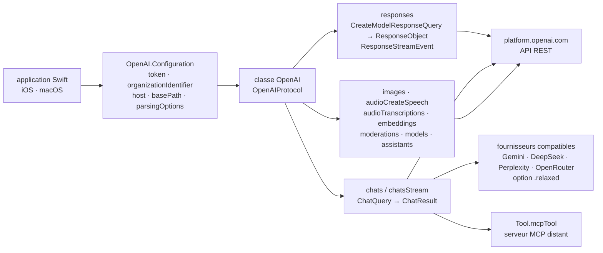

# MacPaw/OpenAI

> **Client Swift de l'API OpenAI, pour qui écrit une application Apple et veut des types plutôt que du JSON.**

## Le problème

Appeler l'API OpenAI depuis une application iOS ou macOS sans bibliothèque revient à écrire
soi-même les structures `Codable` de chaque point d'entrée, le découpage des réponses en flux
(server-sent events), l'envoi multipart des fichiers audio et images, et l'annulation des
requêtes. Ce travail est à refaire à chaque évolution de l'API — et le README le rappelle :
la forme du champ `output` de l'API Responses n'est pas celle qu'on devine, il ne suffit pas
de lire `output[0].content[0].text`.

## Ce que ça fait vraiment

C'est une traduction en Swift de la référence REST publiée par OpenAI, revendiquée comme
« community-maintained » dans la première ligne du README et publiée sous le compte MacPaw.
La classe `OpenAI` est le point d'entrée ; on l'initialise avec un jeton, éventuellement un
identifiant d'organisation et un `timeoutInterval`, et `OpenAI.Configuration` expose aussi
`host`, `basePath`, `port`, `scheme` et `customHeaders`.

La couverture annoncée par le sommaire va de l'API Responses (`client.responses`, avec
`CreateModelResponseQuery` et un flux de `ResponseStreamEvent`) aux Chat Completions
(`chats(query:)`, `chatsStream(query:)`), au *function calling*, aux images (création,
édition, variation), à l'audio (synthèse vocale y compris en flux, transcriptions,
traductions), aux sorties structurées, aux embeddings, aux modérations, à la liste et à la
récupération des modèles, et à la famille Assistants marquée bêta (assistants, threads, runs,
téléversement de fichiers). Les outils MCP distants sont représentés par `Tool.mcpTool`, avec
`serverLabel`, `serverUrl`, `headers`, `allowedTools` et `requireApproval`.

Chaque appel existe en trois formes : closure (qui rend un `CancellableRequest` à conserver
pour annuler), Combine (`sink`, `cancel()`) et concurrence structurée (`try await`,
`for try await`, annulation par `task.cancel()`). La liste des identifiants de modèles est un
simple `typealias Model = String` étendu par des constantes (`gpt5`, `gpt5_mini`, `gpt4_o`,
`gpt4_1`, `whisper_1`…). S'ajoute un utilitaire `Vector.cosineSimilarity` pour comparer deux
embeddings.

Le SDK vise aussi les fournisseurs compatibles OpenAI (Gemini, DeepSeek, Perplexity,
OpenRouter). La règle assumée est que les types principaux restent fidèles à la référence
OpenAI ; les écarts des autres fournisseurs se gèrent par options d'analyse — `.relaxed` pour
le cas général, sinon `fillRequiredFieldIfKeyNotFound` (Gemini omet `id`) et
`fillRequiredFieldIfValueNotFound`. Les champs supplémentaires ont été ajoutés au modèle
commun en optionnel : `citations` (Perplexity), `reasoningContent` (Grok, DeepSeek),
`reasoning` (OpenRouter).

## Comment c'est branché



Aucun diagramme tiré du code n'existe pour ce dépôt : ce schéma est reconstruit depuis le seul
README. Le point à retenir est que tout passe par une instance unique de `OpenAI` configurée
une fois ; les points d'entrée ne sont que des méthodes de ce même objet, et le changement de
fournisseur se joue dans la configuration, pas dans le code d'appel.

## Essayer

L'installation passe par Swift Package Manager. Dans Xcode : **File > Add Package
Dependencies...**, puis l'URL `https://github.com/MacPaw/OpenAI.git` et une règle de version
(par exemple « Up to Next Major Version »). Ou directement dans `Package.swift` :

```swift
dependencies: [
    .package(url: "https://github.com/MacPaw/OpenAI.git", branch: "main")
]
```

Puis, côté code :

```swift
let openAI = OpenAI(apiToken: "YOUR_TOKEN_HERE")

let query = ChatQuery(
    messages: [
        .user(.init(content: .string("Who are you?")))
    ],
    model: .gpt4_o
)

let result = try await openAI.chats(query: query)

print(result.choices.first?.message.content ?? "")
```

Pour un fournisseur tiers, le README donne une seule ligne :

```swift
let configuration = OpenAI.Configuration(token: "", parsingOptions: .fillRequiredFieldIfKeyNotFound)
```

Aucune commande de terminal n'est documentée : ni build, ni tests, ni exécution de la démo.
Le README signale seulement une application iOS d'exemple dans le dossier `Demo`.

## Coût et pièges

- **Clé d'API à ta charge.** Le jeton s'obtient sur `platform.openai.com/account/api-keys`,
  donc compte OpenAI et facturation à l'usage. La bibliothèque est gratuite ; ce qu'elle
  appelle ne l'est pas.
- **La clé ne doit pas vivre dans l'application.** Le README y revient deux fois, en gras puis
  en encadré d'avertissement : les requêtes de production doivent passer par un serveur à soi,
  où la clé est chargée depuis une variable d'environnement ou un gestionnaire de secrets. Une
  clé exposée donne accès à la facturation, à l'usage et aux données d'organisation. Ce n'est
  pas un détail de mise en œuvre : cela signifie qu'une application client seule ne suffit pas,
  il faut un composant serveur en plus.
- **Dépendance totale à un service tiers.** Disponibilité, tarifs, dépréciations de modèles et
  évolutions de schéma sont décidés ailleurs. La liste de modèles n'étant qu'un ensemble de
  constantes `String`, un modèle retiré côté OpenAI ne provoque aucune erreur de compilation.
- **Assistants est marqué bêta** dans le sommaire même du README — API susceptible de bouger.
- **Les fournisseurs tiers sont un mode dégradé assumé** : « limited support ». La priorité
  déclarée est OpenAI, et la conformité à sa référence prime. Les écarts se rattrapent par
  options d'analyse, pas par des types dédiés.
- **Pas de garantie de version** : l'exemple `Package.swift` du README épingle `branch: "main"`,
  ce qui suit la branche de développement. Le texte d'Xcode recommande au contraire une règle
  de version ; les deux se contredisent, choisir la seconde.
- **Plateformes et versions de Swift** ne sont pas listées dans le texte : elles ne se lisent
  que dans les badges Swift Package Index, illisibles hors navigateur.

## Ce que ce n'est pas

- **Ce n'est pas un modèle, ni une inférence locale.** Rien ne tourne sur l'appareil : chaque
  appel part vers l'API. Sans réseau et sans clé, la bibliothèque ne fait rien.
- **Ce n'est pas un cadre d'agents.** Elle expose des requêtes et des réponses typées, pas de
  boucle d'orchestration, pas de mémoire, pas de gestion d'état de conversation. Le
  *function calling* et les outils MCP sont transmis à l'API ; la boucle qui exécute les
  fonctions locales et renvoie leurs résultats reste à écrire — les extraits du README montrent
  explicitement le `switch` à la charge de l'appelant, y compris des branches `default`
  commentées « Unhandled output items. Handle or throw an error. »
- **Ce n'est pas un client officiel d'OpenAI** : le README le décrit comme une implémentation
  maintenue par la communauté. Le suivi des nouveautés de l'API dépend de ses contributeurs,
  pas d'OpenAI.
- **Ce n'est pas une abstraction multi-fournisseurs.** Les types sont ceux d'OpenAI ; les
  autres fournisseurs entrent au forceps, par tolérance d'analyse et champs optionnels ajoutés
  au modèle commun.

## Alternatives

Aucune alternative comparable dans le catalogue : les voisins proposés pour ce dépôt
(`langchain-ai/langgraph`, `openai/openai-agents-python`, `k8sgpt-ai/k8sgpt`,
`business-science/ai-data-science-team`) sont tous des projets Python, dont deux sont des
cadres d'agents et un un diagnostiqueur Kubernetes — aucun ne s'utilise depuis une application
Swift, qui est la seule raison de choisir ce dépôt. Le plus proche par l'intention,
`openai/openai-agents-python`, vient d'OpenAI mais vise l'orchestration d'agents en Python, pas
le simple accès typé à l'API depuis un projet Xcode. Le seul dépôt nommé dans le README comme
appoint est `modelcontextprotocol/swift-sdk`, qui sert à découvrir les outils d'un serveur MCP
avant de les passer à `Tool.mcpTool` : c'est un complément, pas un concurrent.

## Pour toi

Peu d'intérêt direct pour un quotidien data / MLOps, qui se fait en Python : ce dépôt ne sert
que si le livrable est une application iOS ou macOS. Dans ce cas précis, c'est le chemin le
plus court, et le README fait le travail qu'on attend d'une doc — il nomme les pièges (clé à
ne pas embarquer, `output` multi-éléments, écarts des fournisseurs tiers) au lieu de les taire.
À garder sous le coude pour le jour où un prototype doit devenir une démo sur téléphone, avec
le composant serveur qu'exige la clé ; à ignorer autrement.
