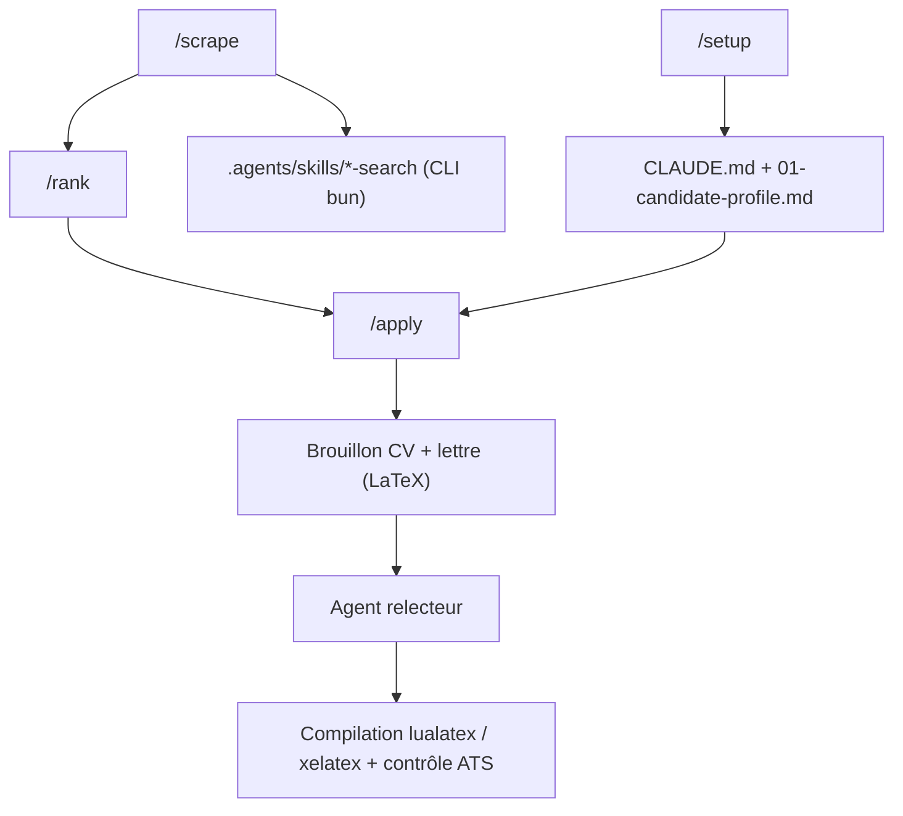

# MadsLorentzen/ai-job-search

> Cadre de recherche d'emploi bâti sur Claude Code : tri, CV, lettres, préparation d'entretien.

## Le problème
Postuler sérieusement demande de relire l'annonce, retailler le CV, écrire une lettre et se
préparer — plusieurs heures par candidature, à recommencer à chaque offre.

## Ce que ça fait vraiment
`/setup` construit ton profil depuis un dossier `documents/`, un CV collé ou un entretien guidé.
`/scrape` interroge des portails d'emploi, déduplique et trie par adéquation ; `/rank` note un lot.
`/apply` évalue l'offre, rédige CV et lettre en LaTeX, fait critiquer les brouillons par un second
agent, révise, compile en PDF et inspecte le rendu jusqu'à 2 pages de CV et 1 page de lettre.
Il extrait ensuite la couche texte du PDF pour vérifier ce qu'un ATS lira. Dix autres commandes
suivent : `/outcome`, `/interview`, `/upskill`, `/html-report`, `/notion-sync`, `/gmail-sync`.

## Comment c'est branché


## Essayer
```bash
gh repo fork MadsLorentzen/ai-job-search --clone
cd ai-job-search
for tool in jobbank-search jobdanmark-search jobindex-search jobnet-search linkedin-search freehire-search; do
  (cd .agents/skills/$tool/cli && bun install)
done
claude
# puis dans Claude Code : /setup, /scrape, /apply <url>
```

## Coût et pièges
Claude Code n'a pas d'offre gratuite : abonnement ou crédits API à ta charge. Il faut Python 3.10+,
Bun, et une distribution LaTeX avec `lualatex` et `xelatex`. Piège majeur signalé par le README :
un fork est toujours public et `/setup` écrit tes données personnelles dans des fichiers suivis par
Git — il faut un dépôt privé. Le scraping LinkedIn est contraire à ses conditions d'utilisation.

## Ce que ce n'est pas
Ce n'est pas un outil clé en main : les skills de portails visent le marché danois, les autres
marchés passent par `/add-portal`. Ce n'est pas un bac à sable : les défenses contre les annonces
piégées sont au niveau des consignes, pas de l'isolation — il faut relire avant d'envoyer.

## Alternatives
Aucune alternative nommée dans le README.

## Pour toi
Moins un outil à adopter qu'un cas d'école de pipeline rédacteur/relecteur avec vérification du rendu.
