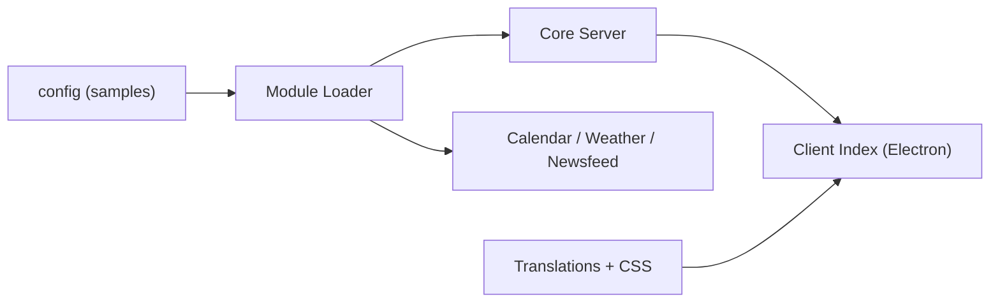

# MagicMirrorOrg/MagicMirror

> Plateforme modulaire de miroir connecté sous Electron, pour bricoleurs qui veulent un assistant sur un miroir.

## Le problème
Afficher heure, agenda, météo et actualités sur un écran derrière un miroir demande d'assembler soi-même l'interface.

## Ce que ça fait vraiment
Application Node/Electron avec un chargeur de modules : horloge, calendrier, météo, flux d'actualités, compliments, alertes, notification de mises à jour. Chaque module peut avoir ses scripts, styles, gabarits et un `node_helper`. Des points d'entrée client seul et serveur seul existent. Installation détaillée uniquement dans la documentation en ligne.

## Comment c'est branché

## Essayer
Aucune commande documentée dans le README fourni ; installation via https://docs.magicmirror.builders.

## Coût et pièges
Gratuit. Matériel (écran, miroir sans tain, Raspberry Pi) à ta charge, non documenté ici. Les modules communautaires appellent des API externes.

## Ce que ce n'est pas
Ce n'est pas un assistant vocal ni une plateforme domotique : c'est un affichage à modules.

## Alternatives
Aucune alternative nommée dans le README.

## Pour toi
Ignorer : projet de bricolage domestique sans rapport avec la data ou le MLOps.

