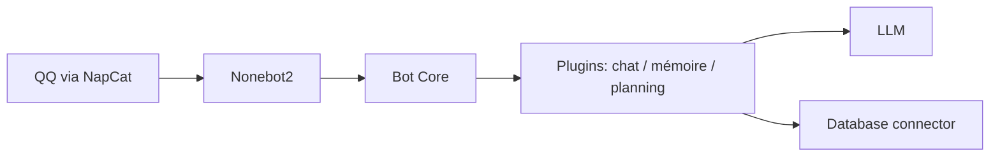

# MaiM-with-u/MaiBot

> Agent conversationnel (MaiSaka) qui imite le style humain dans les groupes QQ, avec mémoire et plugins.

## Le problème
Les assistants classiques répondent en réponses longues et rigides ; ici l'objectif est un compagnon au ton naturel dans des discussions de groupe.

## Ce que ça fait vraiment
Bot bilingue chinois/anglais à base de LLM qui choisit quand parler, imite le style des interlocuteurs, apprend le vocabulaire de groupe et accumule des connaissances sur les utilisateurs. Un système de plugins expose API et événements. D'après le code fourni (ancienne version MaiMBot) : nonebot2, protocole NapCat, MongoDB, plugins chat, mémoire, personnalité, planning.

## Comment c'est branché

## Essayer
Aucune commande documentée dans le README fourni (renvoi à un guide de déploiement et à un lanceur Windows/macOS).

## Coût et pièges
Clés d'API d'un LLM à ta charge, compte QQ et NapCat requis. Le diagramme fourni décrit une ancienne version et peut ne plus refléter v1.2.5.

## Ce que ce n'est pas
Pas un assistant de productivité : le README dit viser « le plus lifelike, pas le meilleur ». Orienté QQ, donc peu utile hors de cet écosystème.

## Alternatives
AstrBot (projet d'agent LLM cité en « amis open source »).

## Pour toi
À ignorer : bot de compagnie lié à QQ, hors du périmètre data/IA/MLOps, dont la documentation utile est ailleurs.
