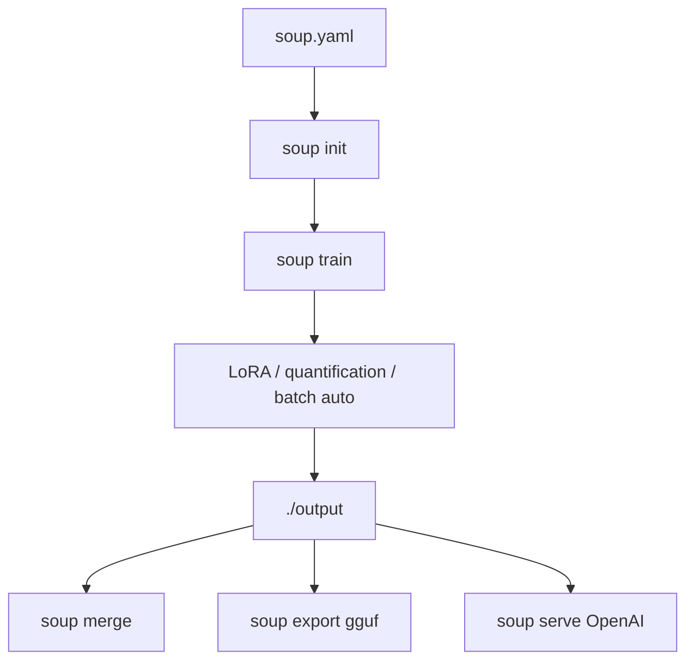

# MakazhanAlpamys/Soup

> CLI pour fine-tuner et post-entraîner des LLM en une commande, config YAML unique.

## Le problème
Fine-tuner un LLM reste pénible : 30-50 % du temps passé à batailler l'infrastructure (SSH, quantification, taille de batch, VRAM) plutôt qu'à améliorer le modèle.

## Ce que ça fait vraiment
Une config `soup.yaml`, une commande `soup train` : LoRA, quantification, détection GPU, batch auto. Layer streaming (opt-in, BETA) garde la base gelée hors VRAM et la diffuse couche par couche — fine-tune un 8B sur un GPU 4 Go (mesuré 119,6 tok/s, 3,32 Go). Tâches SFT/DPO/GRPO/PPO/KTO/ORPO/SimPO. Backends transformers/MLX/Unsloth. Export GGUF/ONNX/AWQ, serveur compatible OpenAI, UI web, `soup doctor`.

## Comment c'est branché


## Essayer
```bash
pipx install "soup-cli[train]"
soup init --template chat
soup train
```

## Coût et pièges
Gratuit. GPU CUDA recommandé (8 Go+ pour 7B QLoRA) ; CPU expérimental très lent. Python 3.10-3.12 seulement. Depuis v0.75, une clé de config inconnue **refuse** le chargement. Télémétrie opt-in. Layer streaming encore BETA, ré-mesure 4 Go en attente.

## Ce que ce n'est pas
Pas un service cloud : entraînement local ou Docker. Pas garanti sur Python 3.13+.

## Alternatives
- Axolotl : cité comme référence de parité de pipeline data.
- Unsloth : proposé comme backend (2-5× plus rapide), pas comme substitut.

## Pour toi
Très pertinent si tu fine-tunes des LLM avec peu de VRAM ; le layer streaming est l'atout. Surveiller (mainteneur unique, projet jeune).
