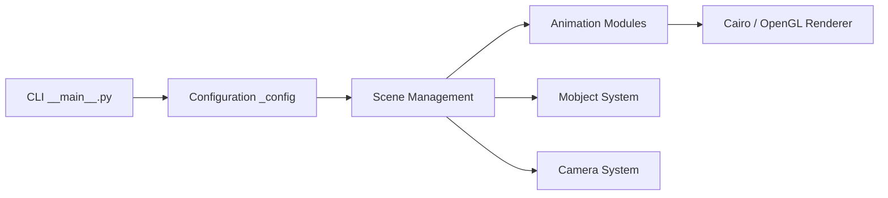

# ManimCommunity/manim

> Moteur d'animation Python pour fabriquer par code des vidéos de mathématiques explicatives, pour enseignants et vulgarisateurs.

## Le problème
Animer précisément une démonstration ou une courbe à la main dans un logiciel de montage est long et peu reproductible.

## Ce que ça fait vraiment
On décrit une `Scene` en Python (formes, transformations, fondus) et la commande `manim` produit la vidéo. Il gère du texte, des graphes, des objets 3D et deux moteurs de rendu (Cairo et OpenGL). Une magie IPython `%%manim` sert dans Jupyter. Cette version communautaire est un fork du dépôt de 3Blue1Brown (3b1b/manim).

## Comment c'est branché


## Essayer
```bash
manim -p -ql example.py SquareToCircle
```

## Coût et pièges
Gratuit. Les dépendances sont à installer avant usage : la marche à suivre est renvoyée vers la documentation, non détaillée dans le README. Une image Docker `manimcommunity/manim` existe. Ne pas mélanger avec les instructions de 3b1b/manim.

## Ce que ce n'est pas
Pas un outil de visualisation de données interactif : il produit des vidéos rendues.

## Alternatives
- 3b1b/manim : version d'origine de Grant Sanderson, moins recommandée par le README.

## Pour toi
Surveiller : intéressant pour animer une explication de modèle ou d'algorithme dans une vidéo, mais sans usage pour les pipelines.

