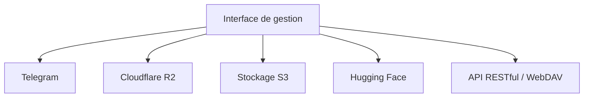

# MarSeventh/CloudFlare-ImgBed

> Hébergeur d'images et fichiers auto-hébergé pour Docker et serverless, multi-stockage.

## Le problème
Héberger images et fichiers demande de jongler entre Telegram, Discord, R2, S3, Hugging Face, WebDAV — chacun avec sa propre gestion, sans interface unique.

## Ce que ça fait vraiment
Rassemble Telegram, Discord, Cloudflare R2, stockage S3-compatible, Hugging Face, WebDAV dans une interface de gestion. Gestion de fichiers, authentification, organisation en répertoires, modération de contenu, API RESTful et WebDAV. Pour hébergement d'images perso, assets de site et distribution légère. Écosystème de plugins (extensions navigateur, Typecho/WordPress/Obsidian). Évolué depuis Telegraph-Image.

## Comment c'est branché

## Essayer
Aucune commande d'installation dans le README (renvoie vers la documentation de déploiement). L'écrire : voir la doc complète du projet.

## Coût et pièges
Gratuit à héberger ; dépend de SaaS de stockage tiers (R2, Telegram, S3…) et de comptes à créer. Mainteneur unique.

## Ce que ce n'est pas
Pas un stockage lui-même : une façade de gestion au-dessus de backends tiers.

## Alternatives
- cf-pages/Telegraph-Image : le projet amont dont il dérive.

## Pour toi
Hors périmètre data/IA : hébergement d'images grand public — ignorer.
