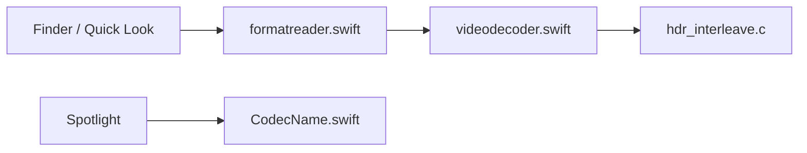

# Marginal/QLVideo

> Miniatures, aperçus Quick Look et métadonnées Finder pour formats vidéo et audio non natifs sur macOS.

## Le problème
macOS ne prévisualise pas MKV, WebM, AVI ou de nombreux codecs.

## Ce que ça fait vraiment
Une extension Spotlight et deux extensions média ajoutent à AVFoundation la lecture de formats et codecs non natifs. Format reader, décodeurs et feuilles de contact sont dans l'arbre. Le README renvoie à un guide de démarrage et de dépannage.

## Comment c'est branché

## Essayer
Aucune commande documentée dans le README (« See Getting Started »). Une version est sur l'App Store.

## Coût et pièges
Gratuit côté dépôt ; macOS uniquement.

## Ce que ce n'est pas
Pas un lecteur vidéo ni un convertisseur. À noter : un autre dépôt, Marginal/QuickLookVideo, a un README identique.

## Alternatives
Perian, ancien équivalent QuickTime cité dans le README.

## Pour toi
Confort macOS sans lien avec un travail data/IA : ignorer.

