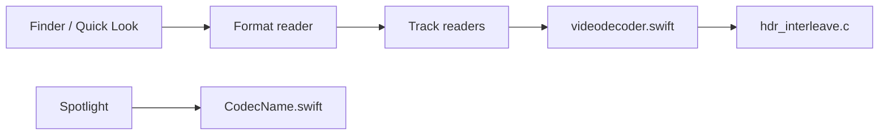

# Marginal/QuickLookVideo

> Miniatures et aperçus Quick Look pour formats vidéo et audio non natifs sur macOS.

## Le problème
macOS ne sait pas prévisualiser MKV, WebM, AVI ni de nombreux codecs.

## Ce que ça fait vraiment
Même README que Marginal/QLVideo : une extension Spotlight et deux extensions média pour AVFoundation. Le graphe cite le format reader, les lecteurs de pistes, la sélection de décodeur, les feuilles de contact et un lecteur de test (`simpleplayer.swift`). Les appels internes ne sont pas confirmés.

## Comment c'est branché

## Essayer
Aucune commande documentée dans le README (« See Getting Started »).

## Coût et pièges
Gratuit côté dépôt ; macOS uniquement, sous forme d'extension Quick Look à installer.

## Ce que ce n'est pas
Pas un lecteur vidéo. Probable doublon ou miroir de Marginal/QLVideo : relation non précisée.

## Alternatives
Perian, ancien équivalent cité dans le README.

## Pour toi
Sans lien avec un travail data/IA, et doublon d'un autre dépôt : ignorer.

