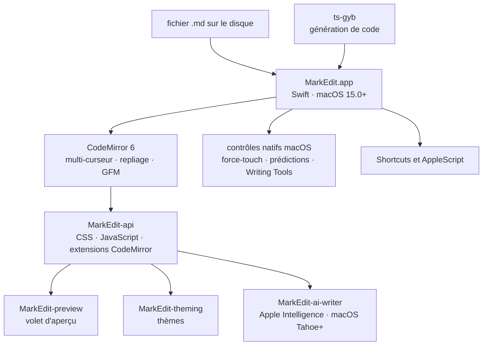

# MarkEdit-app/MarkEdit

> **A native macOS Markdown editor, four megabytes, CodeMirror 6 engine, strictly GFM.**

## The problem

Editing Markdown on a Mac means picking between a heavy Electron app, a native TextKit-based
editor that chokes on a 10 MB file, and a speed-first editor with no system behaviours. The
editors that parse Markdown with regular expressions get the syntax wrong on top of that.

## What it actually does

MarkEdit is a macOS 15.0+ application that opens and edits Markdown files — the README frames
it as "TextEdit but dedicated to Markdown". Nothing more: no note manager, no vault, no sync.

It follows the [GFM specification](https://github.github.com/gfm/) strictly, with no
proprietary syntax and no invented features; the README presents that as a deliberate choice.

Complex editing — multi-caret, code folding — is built on CodeMirror 6, embedded in the app.
The interface stays native: force-touch word lookup, inline predictions, Apple Writing Tools.

Four claims from the README are checkable in use: roughly a 4 MB installer, editing 10 MB
files, no user data collected, and integration with Shortcuts and AppleScript.

Customisation goes through CSS, JavaScript and CodeMirror extensions via the
[MarkEdit-api](https://github.com/MarkEdit-app/MarkEdit-api). Three official extensions are
named: MarkEdit-preview (preview pane), MarkEdit-theming (custom themes) and
MarkEdit-ai-writer (Apple Intelligence, macOS Tahoe or later). The preview pane is therefore
*not* part of the core app.

## How it is wired

No code-derived diagram exists for this repository: the sketch below is rebuilt from the
README alone, using only the pieces it names.



The TypeScript and Swift sides talk through bindings generated with `ts-gyb`, the only build
tool the README names.

## Trying it

The README gives exactly one command; the rest of the install is manual (grab `MarkEdit.dmg`
from the latest release, open it, drag `MarkEdit.app` into `Applications`).

```bash
brew install --cask markedit
```

Development instructions are not in the README — it points to the "Development" wiki page.
Frozen releases exist for older systems (`macos-12`, `macos-13`, `macos-14`).

## Cost and gotchas

- **Free, MIT licensed**, no API key, no quota, no account to create. The README states no
  user data is collected.
- **macOS 15.0 minimum** for the current build; macOS 12 to 14 users get frozen, unmaintained
  release tags.
- **Automatic update checks** run on their own, which implies outbound network access to
  GitHub.
- **Apple Intelligence needs macOS Tahoe or later**, through the MarkEdit-ai-writer extension
  — well above the app's own minimum.
- **Unclear governance**: the README speaks as an unnamed "we", with no company or foundation,
  on a GitHub organisation dedicated to this single product. Hence the single-maintainer flag:
  if the team stops, the app stops.
- **No Windows or Linux build**, and none is stated as a goal.

## What it is not

- **Not a WYSIWYG editor and not a live preview by default**: the preview pane is a separate
  extension, MarkEdit-preview. The core edits source text.
- **Not a note manager**: nothing in the README describes a database, a vault, sync, or
  cross-document search — you open files.
- **Not endlessly extensible**: the README warns MarkEdit is intentionally feature-poor, that
  behaviour changes must be discussed before being proposed, and that any syntax outside GFM
  is refused on principle.

## Alternatives

| | When to pick it |
|---|---|
| **tw93/MiaoYan** | Catalogue neighbour, also a Mac Markdown editor. Pick it if you want built-in note and folder management; MarkEdit only opens files. |
| **marktext/marktext** | Catalogue neighbour: cross-platform Markdown editor with realtime preview. The choice off macOS, or when a built-in preview matters more than installer size. |
| **MarkEdit-app/MarkEdit-api** | Named in the README: not a competitor but the official way to add what is missing (preview, themes, AI) instead of switching editors. |

The other suggested neighbours (`trey-a-12/LaunchBack`, `permissionlesstech/bitchat`) are not
comparable: neither touches text editing or Markdown.

## For you

For a data / AI / MLOps profile on a Mac this is a desktop tool, not a pipeline tool: nothing
here plugs into a workflow, and a README or an experiment note is just as easily written in
the code editor already open. Worth watching if you want a light, strictly GFM editor for
reading documentation without leaving macOS conventions; otherwise skip it.
