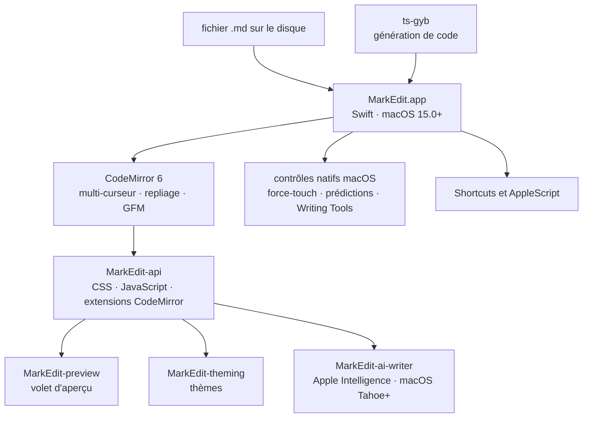

# MarkEdit-app/MarkEdit

> **Éditeur Markdown natif pour macOS, quatre mégaoctets, moteur CodeMirror 6, conforme GFM.**

## Le problème

Sur Mac, éditer du Markdown oblige à choisir entre une application Electron lourde, un
éditeur natif basé sur TextKit qui s'étrangle sur un fichier de 10 Mo, et un éditeur écrit
pour la vitesse mais dépourvu des comportements système. Les éditeurs qui analysent le
Markdown à coups d'expressions régulières, eux, se trompent sur la syntaxe.

## Ce que ça fait vraiment

MarkEdit est une application macOS 15.0+ qui ouvre et édite des fichiers Markdown, présentée
par le README comme « TextEdit mais dédié au Markdown ». Rien d'autre : pas de gestionnaire de
notes, pas de coffre, pas de synchronisation.

Elle suit strictement la [spécification GFM](https://github.github.com/gfm/), sans syntaxe
propriétaire ni extension inventée — c'est revendiqué comme un choix, pas comme une limite.

L'édition complexe (multi-curseur, repliage de code) repose sur CodeMirror 6, embarqué dans
l'application. L'interface, elle, reste native : recherche d'un mot par force-touch,
prédictions en ligne, Writing Tools d'Apple.

Le README annonce quatre chiffres vérifiables à l'usage : installeur d'environ 4 Mo, édition
de fichiers de 10 Mo, aucune collecte de données utilisateur, intégration avec Shortcuts et
AppleScript.

La personnalisation passe par CSS, JavaScript et des extensions CodeMirror via l'API
[MarkEdit-api](https://github.com/MarkEdit-app/MarkEdit-api). Trois extensions officielles
sont citées : MarkEdit-preview (volet d'aperçu), MarkEdit-theming (thèmes), MarkEdit-ai-writer
(Apple Intelligence, macOS Tahoe et plus). Le volet d'aperçu n'est donc *pas* dans le cœur.

## Comment c'est branché

Aucun diagramme tiré du code n'existe pour ce dépôt : ce schéma est reconstruit depuis le
seul README, avec les seules briques qu'il nomme.



Le code TypeScript et le code Swift communiquent par des liaisons générées avec `ts-gyb`,
seul outil de construction nommé dans le README.

## Essayer

Le README donne une seule commande ; le reste de l'installation est manuel (récupérer
`MarkEdit.dmg` depuis la dernière release, l'ouvrir, glisser `MarkEdit.app` dans
`Applications`).

```bash
brew install --cask markedit
```

Les instructions de développement ne sont pas dans le README : il renvoie à la page de wiki
« Development ». Pour un macOS plus ancien, des releases figées existent (`macos-12`,
`macos-13`, `macos-14`).

## Coût et pièges

- **Gratuit, licence MIT**, aucune clé d'API, aucun quota, aucun compte à créer. Le README
  affirme qu'aucune donnée utilisateur n'est collectée.
- **macOS 15.0 minimum** pour la version courante : c'est le vrai prérequis. Sous macOS 12 à
  14, on est renvoyé à des releases figées, donc non maintenues.
- **Mise à jour automatique** : l'application vérifie les mises à jour toute seule, ce qui
  suppose un accès réseau sortant vers GitHub.
- **Apple Intelligence exige macOS Tahoe ou plus récent**, via l'extension MarkEdit-ai-writer
  — pas la version courante minimale.
- **Gouvernance floue** : le README parle au nom d'un « we » jamais nommé, sans entreprise ni
  fondation, sur une organisation GitHub dédiée à ce seul produit. D'où l'alerte
  « mainteneur unique » : si l'équipe s'arrête, l'application s'arrête.
- **Pas de version Windows ni Linux**, et ce n'est pas un objectif déclaré.

## Ce que ce n'est pas

- **Ce n'est pas un éditeur WYSIWYG ni un aperçu en direct par défaut** : le volet d'aperçu
  est une extension à installer, MarkEdit-preview. Le cœur édite du texte source.
- **Ce n'est pas un gestionnaire de notes** : pas de base, pas de coffre, pas de synchronisation
  ni de recherche multi-documents dans ce que documente le README — on ouvre des fichiers.
- **Ce n'est pas un éditeur extensible à volonté** : le README prévient que MarkEdit est
  volontairement pauvre en fonctionnalités et qu'un changement de comportement se discute
  avant d'être proposé ; toute syntaxe hors GFM est refusée par principe.

## Alternatives

| | Quand le préférer |
|---|---|
| **tw93/MiaoYan** | Voisin du catalogue, également éditeur Markdown pour Mac. À préférer si l'on veut une gestion de notes et de dossiers intégrée ; MarkEdit se limite à ouvrir des fichiers. |
| **marktext/marktext** | Voisin du catalogue : éditeur Markdown multiplateforme avec édition en temps réel. Le bon choix hors macOS, ou si l'aperçu intégré compte plus que la taille de l'installeur. |
| **MarkEdit-app/MarkEdit-api** | Nommé dans le README : ce n'est pas un concurrent mais la voie officielle pour ajouter ce qui manque (aperçu, thèmes, IA) au lieu de changer d'éditeur. |

Les autres voisins proposés (`trey-a-12/LaunchBack`, `permissionlesstech/bitchat`) ne sont
pas comparables : ils ne touchent ni à l'édition de texte ni au Markdown.

## Pour toi

Pour un profil data / IA / MLOps sur Mac, c'est un outil de poste de travail, pas un outil de
chaîne : rien ici ne s'intègre à un pipeline, et un README ou une note d'expérience s'écrit
aussi bien dans l'éditeur de code déjà ouvert. À surveiller si l'on tient à un éditeur léger et
strictement GFM pour relire de la documentation sans quitter les conventions de macOS ; sinon,
passer son chemin.
