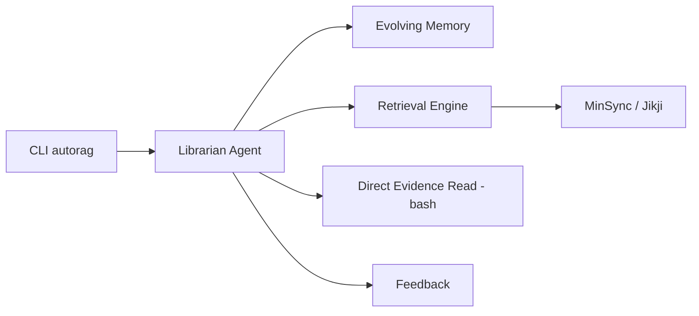

# Marker-Inc-Korea/AutoRAG

> Agent bibliothécaire qui cherche dans tes documents sur place, vérifie les sources et renvoie des résultats numérotés.

## Le problème
Les moteurs de recherche renvoient des chemins et des lignes ; les RAG classiques imposent de copier ses données dans une base vectorielle centrale.

## Ce que ça fait vraiment
Ce dépôt héberge désormais AutoRAG 2.0 (agent, paquet `@autorag/librarian`) ; l'ancien AutoML de pipelines RAG est déplacé dans `legacy/` et maintenu en mode maintenance. L'agent consulte une mémoire, cherche par BM25, vecteurs ou hybride (MinSync), ouvre les fichiers avec `bash` pour vérifier, puis restitue des unités numérotées. Un mode Lite fonctionne sans LLM.

## Comment c'est branché


## Essayer
```bash
npm install -g @autorag/librarian
autorag init --search-paths ~/Documents/research
autorag refresh
autorag search "What are our primary Q3 deliverables?"
```

## Coût et pièges
Node ≥ 24 ou Bun, Java 11+ pour lire les PDF, modèle de raisonnement configuré (jetons à ta charge). L'agent lit tes fichiers avec des commandes shell : réserver à des dossiers que tu acceptes d'exposer. Licence non identifiée par GitHub.

## Ce que ce n'est pas
Pas l'AutoRAG Python d'avant : `pip install AutoRAG` correspond à la version legacy. Plusieurs sous-systèmes ne sont décrits que par le README.

## Alternatives
AutoRAG legacy (dans `legacy/`) pour l'optimisation de pipelines RAG.

## Pour toi
À surveiller : approche « sans migration de données » intéressante, mais jeune, en TypeScript, et à licence à clarifier.
